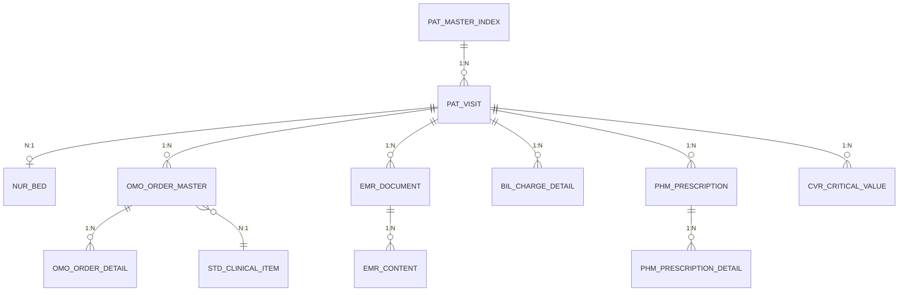
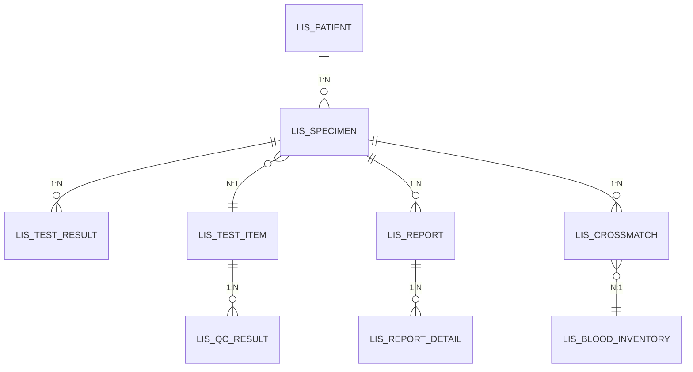
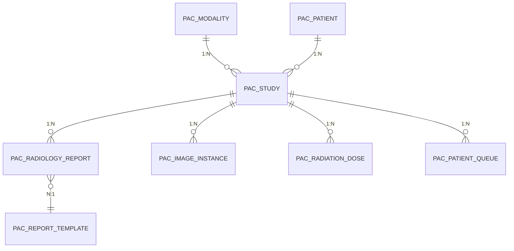
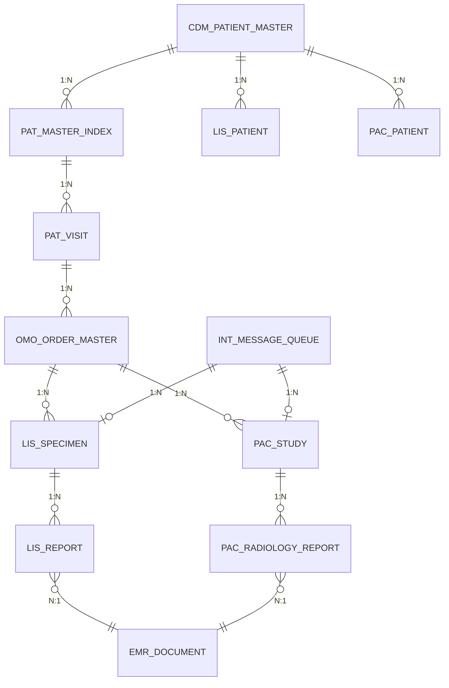
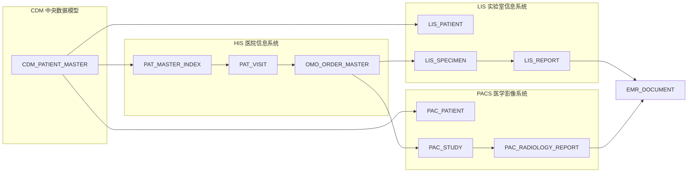

# HIS-LIS-PACS 数据库 ER 图
# Database ER Diagrams for HIS / LIS / PACS Systems

> 本笔记包含 HIS、LIS、PACS 三大医院信息系统的数据库表 ER 关系可视化图。
> This note contains Entity Relationship diagrams for Hospital Information System (HIS), Laboratory Information System (LIS), and Picture Archiving and Communication System (PACS).

## 概述 | Overview

| 系统 | 英文 | 主要功能 |
|------|------|----------|
| HIS | Hospital Information System | 医院核心业务：患者管理、医嘱、收费、电子病历 |
| LIS | Laboratory Information System | 实验室检验：样本管理、检验结果、报告 |
| PACS | Picture Archiving and Communication System | 医学影像：检查、图像存储、报告 |

## 目录 | Table of Contents

### 规划阶段 ER 图
1. [[01_HIS_核心表_ER图]] - HIS 医院信息系统核心表
2. [[02_LIS_核心表_ER图]] - LIS 实验室信息系统核心表
3. [[03_PACS_核心表_ER图]] - PACS 医学影像系统核心表
4. [[04_三系统整体关联图]] - 跨系统数据流转总览

### 实施阶段文档（2026-04-29）
5. [[05_HIS_实际数据库表]] - 基于 JPA Entity 的实际数据库表结构
6. [[06_HIS_UI页面与路由]] - Vue 3 前端页面、路由与 API 对照
7. [[07_HIS_业务流程]] - 门诊/住院/检验/影像/收费业务流程
8. [[08_HIS_数据流程]] - 前后端数据流、跨系统数据流转

---

## HIS 核心表 ER 图

### HIS 核心表清单

| 表名 | 说明 | 主键 |
|------|------|------|
| PAT_MASTER_INDEX | 患者主索引 | patient_id |
| PAT_VISIT | 就诊记录 | visit_id |
| NUR_BED | 床位管理 | bed_id |
| OMO_ORDER_MASTER | 医嘱主表 | order_id |
| OMO_ORDER_DETAIL | 医嘱明细 | detail_id |
| STD_CLINICAL_ITEM | 诊疗项目字典 | item_id |
| EMR_DOCUMENT | 电子病历文档 | doc_id |
| EMR_CONTENT | 病历内容 | content_id |
| BIL_CHARGE_DETAIL | 收费明细 | charge_id |
| PHM_PRESCRIPTION | 处方 | prescription_id |
| PHM_PRESCRIPTION_DETAIL | 处方明细 | detail_id |
| CVR_CRITICAL_VALUE | 危急值记录 | cv_id |

---

## LIS 核心表 ER 图

### LIS 核心表清单

| 表名 | 说明 | 主键 |
|------|------|------|
| LIS_PATIENT | LIS 患者表 | patient_id |
| LIS_SPECIMEN | 样本记录 | specimen_id |
| LIS_TEST_ITEM | 检验项目字典 | item_id |
| LIS_TEST_RESULT | 检验结果 | result_id |
| LIS_QC_RESULT | 质控结果 | qc_id |
| LIS_REPORT | 检验报告 | report_id |
| LIS_REPORT_DETAIL | 报告明细 | detail_id |
| LIS_CROSSMATCH | 配血记录 | crossmatch_id |
| LIS_BLOOD_INVENTORY | 血库库存 | inventory_id |

---

## PACS 核心表 ER 图

### PACS 核心表清单

| 表名 | 说明 | 主键 |
|------|------|------|
| PAC_MODALITY | 影像设备 | modality_id |
| PAC_PATIENT | PACS 患者表 | patient_id |
| PAC_STUDY | 检查记录 | study_id |
| PAC_RADIOLOGY_REPORT | 影像报告 | report_id |
| PAC_IMAGE_INSTANCE | 影像实例 | instance_id |
| PAC_RADIATION_DOSE | 辐射剂量 | dose_id |
| PAC_PATIENT_QUEUE | 患者排队 | queue_id |
| PAC_REPORT_TEMPLATE | 报告模板 | template_id |

---

## 三系统整体关联

### 系统间数据流转

---

## 关键说明

### 1. 患者数据统一
- **CDM_PATIENT_MASTER** 是跨系统的患者主索引
- 各系统患者表通过 `mpi_id` 与 CDM 关联

### 2. 医嘱流转
- HIS 医嘱 (OMO_ORDER_MASTER) 可下发至 LIS 和 PACS
- LIS 生成样本记录 (LIS_SPECIMEN)
- PACS 生成检查记录 (PAC_STUDY)

### 3. 报告归档
- LIS 检验报告和 PACS 影像报告最终归档至 HIS 电子病历 (EMR_DOCUMENT)
- 实现跨系统病历统一管理

### 4. 消息队列
- **INT_MESSAGE_QUEUE** 负责系统间异步消息传递
- 支持医嘱下达、报告回传、危急值上报等业务

---

## 相关资源

- [[his-lis-pacs-database-design|数据库设计文档]]
- [[his-lis-pacs-modules-plan|模块规划文档]]

---
*创建日期: 2026-04-15*
*标签: #HIS #LIS #PACS #数据库 #ER图 #Mermaid*
