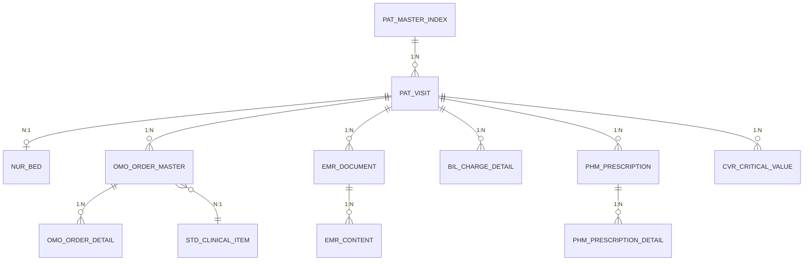

# HIS 核心表 ER 图
# HIS Core Tables Entity Relationship Diagram

> 本文档展示 HIS（医院信息系统）核心业务表的实体关系图。
> This document shows the Entity Relationship diagram for HIS core business tables.

## ER 图

## 表结构说明

### 患者主索引

| 表名 | 说明 | 关联 |
|------|------|------|
| PAT_MASTER_INDEX | 患者唯一标识信息 | 1:N → PAT_VISIT |

### 就诊管理

| 表名 | 说明 | 关联 |
|------|------|------|
| PAT_VISIT | 就诊记录（门诊/急诊/住院） | N:1 ← NUR_BED, 1:N → OMO_ORDER_MASTER |
| NUR_BED | 床位信息 | N:1 → PAT_VISIT |

### 医嘱管理

| 表名 | 说明 | 关联 |
|------|------|------|
| OMO_ORDER_MASTER | 医嘱主表 | 1:N → OMO_ORDER_DETAIL, N:1 ← STD_CLINICAL_ITEM |
| OMO_ORDER_DETAIL | 医嘱明细 | ← OMO_ORDER_MASTER |
| STD_CLINICAL_ITEM | 诊疗项目字典 | N:1 → OMO_ORDER_MASTER |

### 电子病历

| 表名 | 说明 | 关联 |
|------|------|------|
| EMR_DOCUMENT | 病历文档 | 1:N → EMR_CONTENT |
| EMR_CONTENT | 病历内容 | ← EMR_DOCUMENT |

### 收费与处方

| 表名 | 说明 | 关联 |
|------|------|------|
| BIL_CHARGE_DETAIL | 收费明细 | ← PAT_VISIT |
| PHM_PRESCRIPTION | 处方 | 1:N → PHM_PRESCRIPTION_DETAIL |
| PHM_PRESCRIPTION_DETAIL | 处方明细 | ← PHM_PRESCRIPTION |

### 危急值

| 表名 | 说明 | 关联 |
|------|------|------|
| CVR_CRITICAL_VALUE | 危急值报告 | ← PAT_VISIT |

## 关联关系说明

| 关系 | 描述 |
|------|------|
| PAT_MASTER_INDEX → PAT_VISIT | 一个患者有多次就诊 |
| PAT_VISIT → NUR_BED | 一次就诊占用一张床位 |
| PAT_VISIT → OMO_ORDER_MASTER | 一次就诊可开立多条医嘱 |
| OMO_ORDER_MASTER → OMO_ORDER_DETAIL | 一条医嘱包含多条明细 |
| OMO_ORDER_MASTER → STD_CLINICAL_ITEM | 医嘱引用诊疗项目字典 |
| PAT_VISIT → EMR_DOCUMENT | 一次就诊有多份病历 |
| EMR_DOCUMENT → EMR_CONTENT | 一份病历有多个内容版本 |
| PAT_VISIT → BIL_CHARGE_DETAIL | 一次就诊产生多笔收费 |
| PAT_VISIT → PHM_PRESCRIPTION | 一次就诊可开立多个处方 |
| PHM_PRESCRIPTION → PHM_PRESCRIPTION_DETAIL | 一个处方包含多条药品明细 |
| PAT_VISIT → CVR_CRITICAL_VALUE | 一次就诊可产生多个危急值报告 |

---
*相关文档: [[00_HIS_LIS_PACS_数据库ER图]] [[04_三系统整体关联图]]*
*标签: #HIS #ER图 #数据库设计*
