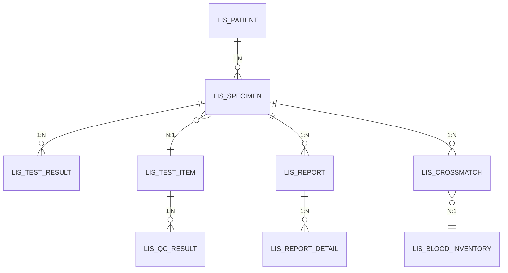

# LIS 核心表 ER 图
# LIS Core Tables Entity Relationship Diagram

> 本文档展示 LIS（实验室信息系统）核心业务表的实体关系图。
> This document shows the Entity Relationship diagram for LIS core business tables.

## ER 图

## 表结构说明

### 患者与样本

| 表名 | 说明 | 关联 |
|------|------|------|
| LIS_PATIENT | LIS 患者信息 | 1:N → LIS_SPECIMEN |
| LIS_SPECIMEN | 样本记录 | N:1 ← LIS_PATIENT, 1:N → LIS_TEST_RESULT, LIS_REPORT |

### 检验项目管理

| 表名 | 说明 | 关联 |
|------|------|------|
| LIS_TEST_ITEM | 检验项目字典 | N:1 → LIS_SPECIMEN, 1:N → LIS_QC_RESULT |
| LIS_TEST_RESULT | 检验结果 | ← LIS_SPECIMEN |
| LIS_QC_RESULT | 质控结果 | ← LIS_TEST_ITEM |

### 报告管理

| 表名 | 说明 | 关联 |
|------|------|------|
| LIS_REPORT | 检验报告 | 1:N → LIS_REPORT_DETAIL |
| LIS_REPORT_DETAIL | 报告明细 | ← LIS_REPORT |

### 输血管理

| 表名 | 说明 | 关联 |
|------|------|------|
| LIS_CROSSMATCH | 配血记录 | N:1 → LIS_BLOOD_INVENTORY |
| LIS_BLOOD_INVENTORY | 血库库存 | ← LIS_CROSSMATCH |

## 关联关系说明

| 关系 | 描述 |
|------|------|
| LIS_PATIENT → LIS_SPECIMEN | 一个患者有多个样本 |
| LIS_SPECIMEN → LIS_TEST_RESULT | 一个样本有多个检验结果 |
| LIS_SPECIMEN → LIS_TEST_ITEM | 样本关联检验项目（N:1） |
| LIS_TEST_ITEM → LIS_QC_RESULT | 一个检验项目有多个质控结果 |
| LIS_SPECIMEN → LIS_REPORT | 一个样本对应一份报告 |
| LIS_REPORT → LIS_REPORT_DETAIL | 一份报告包含多条明细 |
| LIS_SPECIMEN → LIS_CROSSMATCH | 配血申请关联样本 |
| LIS_CROSSMATCH → LIS_BLOOD_INVENTORY | 配血结果关联血库库存 |

---
*相关文档: [[00_HIS_LIS_PACS_数据库ER图]] [[04_三系统整体关联图]]*
*标签: #LIS #ER图 #数据库设计*
