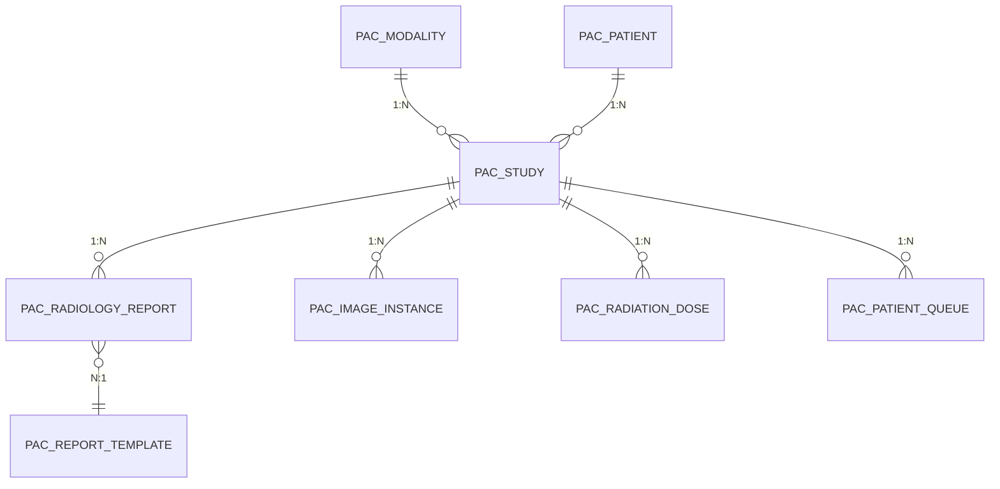

# PACS 核心表 ER 图
# PACS Core Tables Entity Relationship Diagram

> 本文档展示 PACS（医学影像系统）核心业务表的实体关系图。
> This document shows the Entity Relationship diagram for PACS core business tables.

## ER 图

## 表结构说明

### 设备与患者

| 表名 | 说明 | 关联 |
|------|------|------|
| PAC_MODALITY | 影像设备 | 1:N → PAC_STUDY |
| PAC_PATIENT | PACS 患者信息 | 1:N → PAC_STUDY |

### 检查管理

| 表名 | 说明 | 关联 |
|------|------|------|
| PAC_STUDY | 检查记录 | N:1 ← PAC_MODALITY, PAC_PATIENT |

### 报告与影像

| 表名 | 说明 | 关联 |
|------|------|------|
| PAC_RADIOLOGY_REPORT | 影像报告 | N:1 → PAC_REPORT_TEMPLATE |
| PAC_IMAGE_INSTANCE | 影像实例 | ← PAC_STUDY |
| PAC_RADIATION_DOSE | 辐射剂量记录 | ← PAC_STUDY |
| PAC_PATIENT_QUEUE | 患者排队叫号 | ← PAC_STUDY |
| PAC_REPORT_TEMPLATE | 报告模板 | ← PAC_RADIOLOGY_REPORT |

## 关联关系说明

| 关系 | 描述 |
|------|------|
| PAC_MODALITY → PAC_STUDY | 一台设备进行多次检查 |
| PAC_PATIENT → PAC_STUDY | 一个患者有多次检查 |
| PAC_STUDY → PAC_RADIOLOGY_REPORT | 一次检查有一份影像报告 |
| PAC_STUDY → PAC_IMAGE_INSTANCE | 一次检查有多幅影像 |
| PAC_STUDY → PAC_RADIATION_DOSE | 一次检查记录一次辐射剂量 |
| PAC_STUDY → PAC_PATIENT_QUEUE | 一次检查对应一个排队号 |
| PAC_RADIOLOGY_REPORT → PAC_REPORT_TEMPLATE | 报告引用报告模板 |

---
*相关文档: [[00_HIS_LIS_PACS_数据库ER图]] [[04_三系统整体关联图]]*
*标签: #PACS #ER图 #数据库设计*
