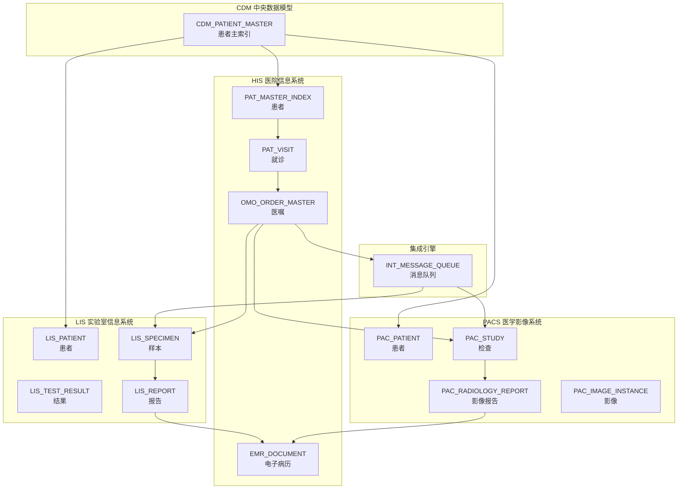
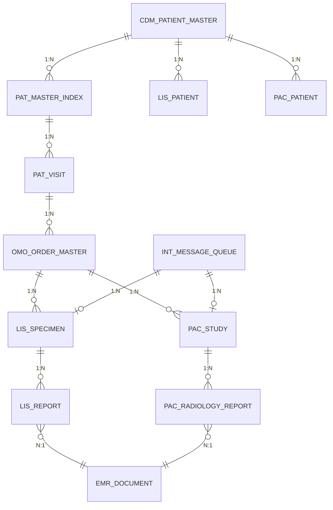
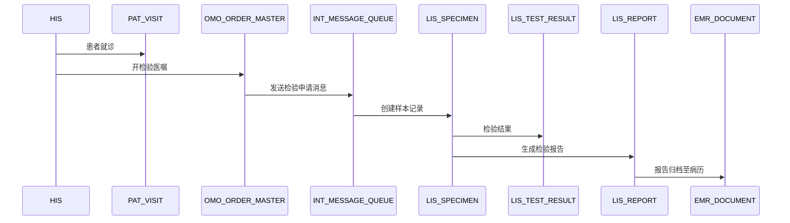
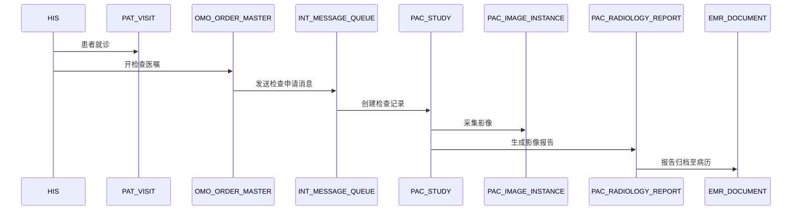

# 三系统整体关联图
# HIS-LIS-PACS Cross-System Integration Overview

> 本文档展示 HIS、LIS、PACS 三大系统间的数据流转与关联关系。
> This document shows the data flow and relationships between HIS, LIS, and PACS systems.

## 系统架构总览

## 跨系统 ER 关系

## 数据流转说明

### 1. 患者数据统一

| 步骤 | 系统 | 表 | 说明 |
|------|------|-----|------|
| 1 | CDM | CDM_PATIENT_MASTER | 创建中央患者主索引 |
| 2 | HIS | PAT_MASTER_INDEX | HIS 患者注册，获取 mpi_id |
| 3 | LIS | LIS_PATIENT | LIS 通过 mpi_id 关联患者 |
| 4 | PACS | PAC_PATIENT | PACS 通过 mpi_id 关联患者 |

### 2. 检验业务流程

### 3. 检查业务流程

## 系统间接口类型

| 源系统 | 目标系统 | 接口类型 | 说明 |
|--------|----------|----------|------|
| HIS | LIS | ORM→ORM | 检验医嘱下达 |
| HIS | PACS | ORM→MWL | 检查医嘱下达 (Worklist) |
| LIS | HIS | ORU | 检验报告回传 |
| PACS | HIS | ORU/DICOM SR | 影像报告回传 |
| LIS/PACS | HIS | 自定义 | 危急值上报 |

## 消息队列消息类型

| 消息类型 | 源 | 目标 | 说明 |
|----------|-----|------|------|
| HIS_ORDER_LIS | HIS | LIS | 检验医嘱 |
| LIS_SPECIMEN_COLLECTED | LIS | HIS | 样本采集通知 |
| LIS_REPORT_READY | LIS | HIS | 检验报告完成 |
| HIS_ORDER_PACS | HIS | PACS | 检查医嘱 |
| PAC_STUDY_COMPLETED | PACS | HIS | 检查完成通知 |
| PAC_REPORT_READY | PACS | HIS | 影像报告完成 |
| CRITICAL_VALUE | LIS/PACS | HIS | 危急值上报 |

## 公共表说明

| 表名 | 说明 | 作用 |
|------|------|------|
| CDM_PATIENT_MASTER | 患者主索引 | 跨系统患者身份统一 |
| INT_MESSAGE_QUEUE | 消息队列 | 系统间异步消息传递 |
| EMR_DOCUMENT | 电子病历文档 | LIS/PACS 报告统一归档 |

---
*相关文档: [[00_HIS_LIS_PACS_数据库ER图]] [[01_HIS_核心表_ER图]] [[02_LIS_核心表_ER图]] [[03_PACS_核心表_ER图]]*
*标签: #系统集成 #数据流转 #接口设计*
