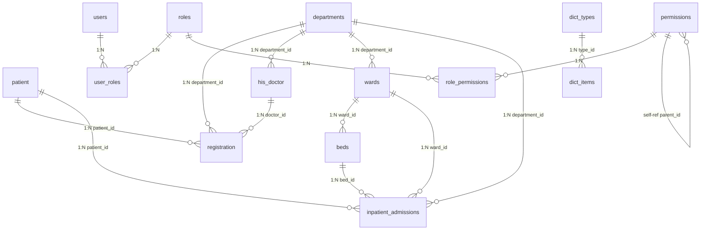

# HIS 实际数据库表（JPA Entity 映射）

> 本文档基于项目代码中实际存在的 JPA Entity，映射到数据库表。
> 项目路径: `~/projects/his-lis-pacs/`
> 规划阶段的 ER 图见 [[00_HIS_LIS_PACS_数据库ER图]] [[01_HIS_核心表_ER图]]

## 概览

| 分类 | 表数量 | 表名 |
|------|:------:|------|
| 门诊业务 (HIS) | 4 | patient, registration, his_doctor, pacs_image_study |
| 住院管理 | 1 | inpatient_admissions |
| 基础数据 | 4 | departments, wards, beds, dict_types + dict_items |
| 系统管理 | 6 | users, roles, permissions, user_roles, role_permissions, system_config, audit_log |

---

## 一、门诊业务表

### 1. patient（患者表）

| 字段 | 类型 | 约束 | 说明 |
|------|------|------|------|
| id | Long (BIGSERIAL) | PK, 自增 | 主键 |
| patient_no | VARCHAR(20) | UNIQUE, NOT NULL | 患者编号 |
| patient_name | VARCHAR(100) | NOT NULL | 姓名 |
| gender | VARCHAR(10) | | 性别 |
| birthday | DATE | | 出生日期 |
| id_card | VARCHAR(18) | | 身份证号 |
| phone | VARCHAR(20) | | 联系电话 |
| address | VARCHAR(200) | | 地址 |
| emergency_contact | VARCHAR(50) | | 紧急联系人 |
| emergency_phone | VARCHAR(20) | | 紧急联系电话 |
| blood_type | VARCHAR(50) | | 血型 |
| allergy_history | VARCHAR(500) | | 过敏史 |
| past_history | VARCHAR(500) | | 既往史 |
| family_history | VARCHAR(500) | | 家族史 |
| marital_status | VARCHAR(20) | | 婚姻状况 |
| occupation | VARCHAR(50) | | 职业 |
| nationality | VARCHAR(30) | | 国籍 |
| ethnicity | VARCHAR(30) | | 民族 |
| create_time | TIMESTAMP | | 创建时间 |
| update_time | TIMESTAMP | | 更新时间 |

### 2. registration（挂号表）

| 字段 | 类型 | 约束 | 说明 |
|------|------|------|------|
| id | Long (BIGSERIAL) | PK | 主键 |
| patient_id | Long | NOT NULL, FK→patient | 患者ID |
| department_id | Long | NOT NULL, FK→departments | 科室ID |
| doctor_id | Long | NOT NULL, FK→his_doctor | 医生ID |
| registration_time | TIMESTAMP | NOT NULL | 挂号时间 |
| visit_sequence | INTEGER | NOT NULL | 当日序号 |
| fee_amount | DOUBLE | NOT NULL | 挂号费 |
| status | VARCHAR(20) | NOT NULL | 状态: REGISTERED/VISITED/CANCELLED/REFUNDED |
| **患者快照字段** | | | 从 patient 表冗余 |
| patient_name | VARCHAR(100) | | 患者姓名 |
| gender | VARCHAR(10) | | 性别 |
| birthday | DATE | | 出生日期 |
| id_card | VARCHAR(18) | | 身份证号 |
| phone | VARCHAR(20) | | 电话 |
| address | VARCHAR(200) | | 地址 |
| emergency_contact | VARCHAR(50) | | 紧急联系人 |
| emergency_phone | VARCHAR(20) | | 紧急电话 |
| blood_type | VARCHAR(50) | | 血型 |
| allergy_history | VARCHAR(500) | | 过敏史 |
| past_history | VARCHAR(500) | | 既往史 |
| family_history | VARCHAR(500) | | 家族史 |
| marital_status | VARCHAR(20) | | 婚姻状况 |
| occupation | VARCHAR(50) | | 职业 |
| nationality | VARCHAR(30) | | 国籍 |
| ethnicity | VARCHAR(30) | | 民族 |
| **科室/医生快照** | | | |
| department_name | VARCHAR(100) | | 科室名称 |
| doctor_name | VARCHAR(100) | | 医生姓名 |
| doctor_title | VARCHAR(50) | | 医生职称 |
| create_time | TIMESTAMP | | 创建时间 |
| update_time | TIMESTAMP | | 更新时间 |

> **设计要点:** 挂号时自动从 Patient 表填充快照，当日序号自增，状态机管理

### 3. his_doctor（医生表）

| 字段 | 类型 | 约束 | 说明 |
|------|------|------|------|
| id | Long (BIGSERIAL) | PK | 主键 |
| doctor_code | VARCHAR | | 医生编号(工号) |
| doctor_name | VARCHAR | | 医生姓名 |
| doctor_name_pinyin | VARCHAR | | 姓名拼音 |
| gender | VARCHAR | | 性别: 0-女, 1-男 |
| birth_date | DATE | | 出生日期 |
| phone | VARCHAR | | 联系电话 |
| id_card | VARCHAR | | 身份证号 |
| email | VARCHAR | | 邮箱 |
| department_id | Long | FK→departments | 科室ID |
| department_name | VARCHAR | | 科室名称(冗余) |
| title | VARCHAR | | 职称 |
| position | VARCHAR | | 职务 |
| specialty | VARCHAR | | 擅长领域 |
| introduction | VARCHAR | | 简介 |
| avatar | VARCHAR | | 头像URL |
| sort_order | INTEGER | | 排序 |
| enabled | BOOLEAN | | 状态 |
| is_expert | BOOLEAN | | 是否专家 |
| created_at | TIMESTAMP | | 创建时间 |
| updated_at | TIMESTAMP | | 更新时间 |

### 4. pacs_image_study（影像检查表）

| 字段 | 类型 | 约束 | 说明 |
|------|------|------|------|
| id | Long (BIGSERIAL) | PK | 主键 |
| study_no | VARCHAR | UNIQUE, NOT NULL | 检查号 |
| patient_name | VARCHAR | NOT NULL | 患者姓名 |
| admission_no | VARCHAR | | 住院号 |
| patient_id | Long | | 患者ID |
| gender | INTEGER | | 0-未知, 1-男, 2-女 |
| age | INTEGER | | 年龄 |
| modality | VARCHAR | NOT NULL | 设备类型: CT/MR/DR/CR |
| body_part | VARCHAR | NOT NULL | 检查部位 |
| study_date | DATE | NOT NULL | 检查日期 |
| study_time | TIME | | 检查时间 |
| request_dept | VARCHAR | NOT NULL | 申请科室 |
| request_doctor | VARCHAR | | 申请医生 |
| equipment | VARCHAR | | 设备 |
| reading_doctor | VARCHAR | | 阅片医生 |
| clinical_diagnosis | VARCHAR | | 临床诊断 |
| clinical_hint | VARCHAR | | 临床提示 |
| fee | DECIMAL | | 费用 |
| status | INTEGER | default 0 | 0-待检查, 1-检查中, 2-已完成, 3-已阅片 |
| dicom_path | VARCHAR | | DICOM文件路径 |
| image_count | INTEGER | default 0 | 图像数量 |
| report_id | Long | | 报告ID |
| remark | VARCHAR | | 备注 |
| created_at / updated_at | TIMESTAMP | | 时间戳 |

---

## 二、住院管理表

### 5. inpatient_admissions（住院登记表）

| 字段 | 类型 | 约束 | 说明 |
|------|------|------|------|
| id | Long (BIGSERIAL) | PK | 主键 |
| admission_no | VARCHAR(50) | UNIQUE, NOT NULL | 住院号 |
| patient_id | Long | NOT NULL | 患者ID |
| patient_name | VARCHAR(100) | NOT NULL | 患者姓名 |
| department_id | Long | NOT NULL | 科室ID |
| department_name | VARCHAR(100) | NOT NULL | 科室名称 |
| ward_id | Long | NOT NULL | 病房ID |
| ward_name | VARCHAR(100) | NOT NULL | 病房名称 |
| bed_id | Long | NOT NULL | 床位ID |
| bed_no | VARCHAR(50) | NOT NULL | 床号 |
| attending_doctor_id | Long | | 主治医生ID |
| attending_doctor_name | VARCHAR(100) | | 主治医生姓名 |
| admission_date | DATE | NOT NULL | 入院日期 |
| discharge_date | DATE | | 出院日期 |
| chief_complaint | VARCHAR(500) | | 主诉 |
| diagnosis | VARCHAR(1000) | | 诊断 |
| status | ENUM | NOT NULL | ADMITTED/DISCHARGED/TRANSFERRED |
| create_time / update_time | TIMESTAMP | | 时间戳 |

---

## 三、基础数据表

### 6. departments（科室表）

| 字段 | 类型 | 约束 | 说明 |
|------|------|------|------|
| id | Long (BIGSERIAL) | PK | 主键 |
| dept_name | VARCHAR(100) | NOT NULL | 科室名称 |
| dept_code | VARCHAR(20) | UNIQUE, NOT NULL | 科室编码 |
| dept_type | VARCHAR(20) | | 类型: clinical/medical/admin/logistics |
| parent_id | Long | | 父科室ID (支持树形) |
| sort_order | INTEGER | | 排序 |
| enabled | BOOLEAN | default true | 启用状态 |
| created_at / updated_at | TIMESTAMP | | 时间戳 |

### 7. wards（病房表）

| 字段 | 类型 | 约束 | 说明 |
|------|------|------|------|
| id | Long (BIGSERIAL) | PK | 主键 |
| ward_name | VARCHAR(100) | NOT NULL | 病房名称 |
| ward_code | VARCHAR(20) | UNIQUE, NOT NULL | 病房编码 |
| department_id | Long | NOT NULL | 所属科室ID |
| total_beds | INTEGER | | 总床位数 |
| available_beds | INTEGER | | 可用床位数 |
| location | VARCHAR(200) | | 位置 |
| sort_order | INTEGER | | 排序 |
| enabled | BOOLEAN | default true | 启用状态 |
| created_at / updated_at | TIMESTAMP | | 时间戳 |

### 8. beds（床位表）

| 字段 | 类型 | 约束 | 说明 |
|------|------|------|------|
| id | Long (BIGSERIAL) | PK | 主键 |
| bed_no | VARCHAR(20) | NOT NULL | 床号 |
| bed_name | VARCHAR(100) | | 床位名称 |
| ward_id | Long | NOT NULL | 所属病房ID |
| room_no | VARCHAR(20) | | 房间号 |
| floor | INTEGER | | 楼层 |
| bed_type | VARCHAR(20) | | 类型: ordinary/vip/icu/emergency |
| price | DECIMAL(10,2) | | 床位费/天 |
| status | INTEGER | default 0 | 0=空闲, 1=占用, 2=清洁中 |
| enabled | BOOLEAN | default true | 启用状态 |
| created_at / updated_at | TIMESTAMP | | 时间戳 |

### 9. dict_types + dict_items（数据字典）

**dict_types（字典类型）**

| 字段 | 类型 | 约束 | 说明 |
|------|------|------|------|
| id | Long (BIGSERIAL) | PK | 主键 |
| dict_name | VARCHAR | NOT NULL | 字典名称 |
| dict_code | VARCHAR | UNIQUE, NOT NULL | 字典编码 |
| description | VARCHAR | | 描述 |
| parent_id | Long | | 父级ID |
| sort_order | INTEGER | | 排序 |
| enabled | BOOLEAN | default true | 启用 |

**dict_items（字典项）**

| 字段 | 类型 | 约束 | 说明 |
|------|------|------|------|
| id | Long (BIGSERIAL) | PK | 主键 |
| type_id | Long | NOT NULL, FK→dict_types | 所属类型ID |
| item_name | VARCHAR | NOT NULL | 项名称 |
| item_code | VARCHAR | UNIQUE, NOT NULL | 项编码 |
| description | VARCHAR | | 描述 |
| sort_order | INTEGER | default 0 | 排序 |
| css_tag | VARCHAR | | CSS标签 |
| enabled | BOOLEAN | default true | 启用 |

---

## 四、系统管理表（RBAC）

### 10. users（用户表）

| 字段 | 类型 | 约束 | 说明 |
|------|------|------|------|
| id | Long (BIGSERIAL) | PK | 主键 |
| username | VARCHAR | UNIQUE, NOT NULL | 用户名 |
| password | VARCHAR | NOT NULL | 密码(BCrypt) |
| real_name | VARCHAR | | 真实姓名 |
| email | VARCHAR | | 邮箱 |
| phone | VARCHAR | | 电话 |
| gender | VARCHAR | | 性别 |
| dept_id | Long | | 科室ID |
| enabled | BOOLEAN | default true | 启用 |
| last_login_time | TIMESTAMP | | 最后登录时间 |
| last_login_ip | VARCHAR | | 最后登录IP |
| account_non_locked | BOOLEAN | default true | 账户未锁定 |
| locked_until | TIMESTAMP | | 锁定截止时间 |
| password_expire_time | TIMESTAMP | | 密码过期时间 |
| login_attempts | INTEGER | default 0 | 登录尝试次数 |
| first_login | BOOLEAN | default true | 首次登录 |
| **关联:** ManyToMany → roles (via user_roles) | | | |

### 11. roles（角色表）

| 字段 | 类型 | 约束 | 说明 |
|------|------|------|------|
| id | Long (BIGSERIAL) | PK | 主键 |
| role_name | VARCHAR | NOT NULL | 角色名称 |
| role_code | VARCHAR | UNIQUE, NOT NULL | 角色编码 |
| description | VARCHAR | | 描述 |
| enabled | BOOLEAN | default true | 启用 |
| **关联:** ManyToMany → permissions (via role_permissions) | | | |

### 12. permissions（权限表）

| 字段 | 类型 | 约束 | 说明 |
|------|------|------|------|
| id | Long (BIGSERIAL) | PK | 主键 |
| permission_name | VARCHAR | NOT NULL | 权限名称 |
| permission_key | VARCHAR | UNIQUE, NOT NULL | 权限标识 |
| permission_code | VARCHAR | | 权限编码(旧字段) |
| type | INTEGER | | 1=菜单, 2=页面, 3=按钮 |
| parent_id | Long | | 父权限ID |
| sort_order | INTEGER | default 0 | 排序 |
| icon | VARCHAR | | 图标 |
| path | VARCHAR | | 路由路径 |
| enabled | BOOLEAN | default true | 启用 |
| **关联:** ManyToOne → parent, OneToMany → children | | | |

### 13. 中间表

| 表名 | 字段 | 说明 |
|------|------|------|
| user_roles | user_id, role_id | 用户-角色关联 |
| role_permissions | role_id, permission_id | 角色-权限关联 |

### 14. system_config（系统参数表）

| 字段 | 类型 | 约束 | 说明 |
|------|------|------|------|
| id | Long (BIGSERIAL) | PK | 主键 |
| config_key | VARCHAR | UNIQUE, NOT NULL | 参数键 |
| config_name | VARCHAR | NOT NULL | 参数名称 |
| config_value | TEXT | | 参数值 |
| config_type | VARCHAR | | 值类型 |
| status | INTEGER | default 1 | 状态 |
| remark | TEXT | | 备注 |
| module_code | VARCHAR | | 模块编码 |
| category | VARCHAR | | 分类 |
| is_encrypted | BOOLEAN | default false | 是否加密 |
| is_readonly | BOOLEAN | default false | 是否只读 |
| sort_order | INTEGER | | 排序 |
| valid_from / valid_to | TIMESTAMP | | 有效期 |
| change_reason | TEXT | | 变更原因 |

### 15. audit_log（审计日志表）

| 字段 | 类型 | 约束 | 说明 |
|------|------|------|------|
| id | Long (BIGSERIAL) | PK | 主键 |
| username | VARCHAR | | 操作用户 |
| module | VARCHAR | | 模块 |
| action | VARCHAR | | 操作 |
| detail | TEXT | | 详情 |
| ip | VARCHAR | | IP地址 |
| status | VARCHAR | | 状态 |
| request_method | VARCHAR | | 请求方法 |
| request_params | TEXT | | 请求参数 |
| execution_time | Long | | 执行时间(ms) |
| user_agent | VARCHAR | | 浏览器UA |
| is_success | BOOLEAN | | 是否成功 |
| created_at | TIMESTAMP | | 创建时间 |

---

## 表关系总览（实际代码）

---

## 与规划阶段对比

| 规划表名 | 实际表名 | 状态 | 备注 |
|----------|----------|:----:|------|
| PAT_MASTER_INDEX | patient | ✅ | 已实现 |
| PAT_VISIT | registration | ✅ | 挂号即就诊入口 |
| NUR_BED | beds | ✅ | 已实现 |
| OMO_ORDER_MASTER | — | ❌ | 待实现 |
| EMR_DOCUMENT | — | ❌ | 待实现 |
| BIL_CHARGE_DETAIL | — | ❌ | 待实现 |
| PHM_PRESCRIPTION | — | ❌ | 待实现 |
| LIS_SPECIMEN | — | ❌ | LIS 待实现 |
| PAC_STUDY | pacs_image_study | ✅ | 已实现 |

---

*相关文档: [[00_HIS_LIS_PACS_数据库ER图]] [[01_HIS_核心表_ER图]] [[06_HIS_UI页面与路由]]*
*标签: #HIS #数据库 #JPA #PostgreSQL*
