# HIS 业务流程

> 医院信息系统核心业务流程梳理
> 涵盖门诊、住院、检验、影像、收费五大业务线

## 一、门诊就诊流程（核心主流程）

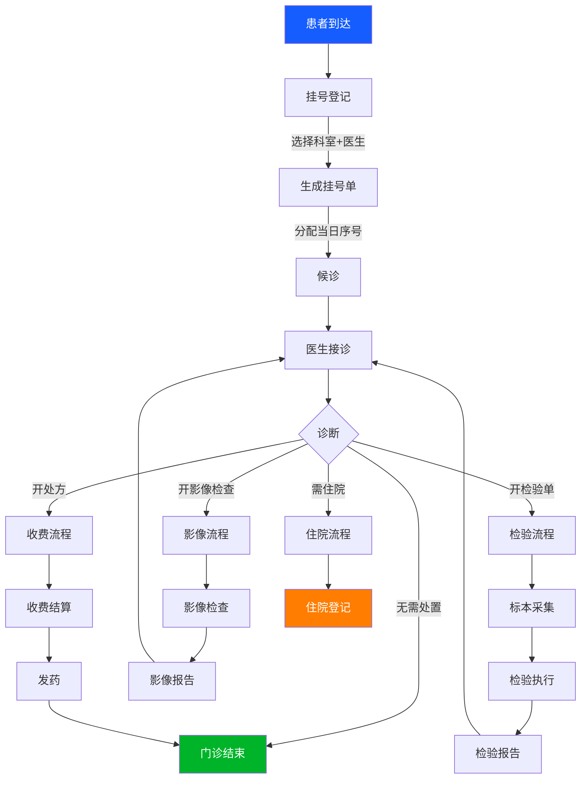

### 挂号四步流程（已实现）

**挂号状态机:**
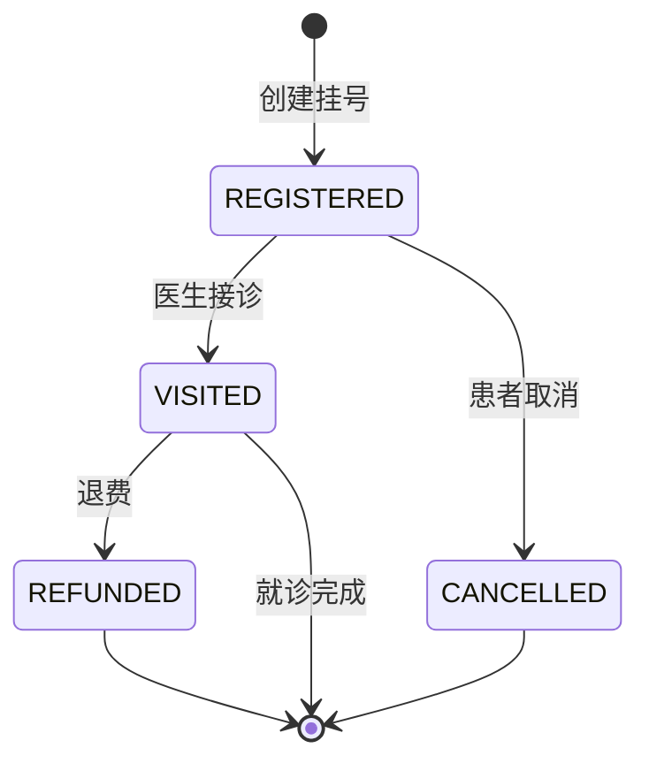

**实现细节:**
- 挂号时自动从 Patient 表填充患者快照（姓名、性别、身份证、过敏史等 16 个字段）
- 科室/医生信息同步快照到挂号单
- 当日序号自增（visit_sequence）
- 前端: `his/RegistrationManagement.vue` → `api/registration.js`
- 后端: `RegistrationController` → `RegistrationService` → `Registration` Entity

---

## 二、住院流程

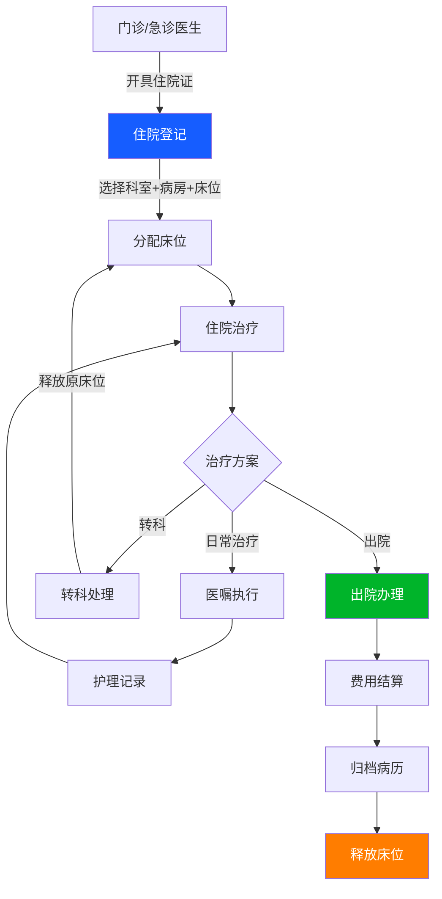

**住院登记字段:**
- 住院号（自动生成）
- 患者ID + 姓名
- 科室 + 病房 + 床位
- 主治医生
- 入院日期
- 主诉 + 诊断
- 状态: ADMITTED / DISCHARGED / TRANSFERRED

**实现:**
- 前端: `inpatient/AdmissionManagement.vue` → `api/inpatient.js`
- 后端: `AdmissionController` → `AdmissionService` → `Admission` Entity

---

## 三、检验流程 (LIS)

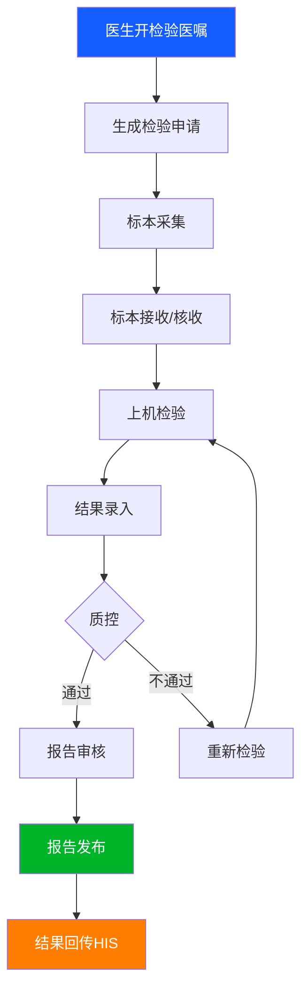

**前端页面（4 页已实现 UI）:**
| 页面 | 功能 |
|------|------|
| 检验工作列表 | 待检/在检/已完成任务管理 |
| 样本管理 | 样本接收、核收、查询 |
| 检验项目 | 检验项目/套餐字典管理 |
| 检验报告 | 报告查看、审核、打印 |

> ⚠️ 后端 Service/Controller 待实现

---

## 四、影像流程 (PACS)

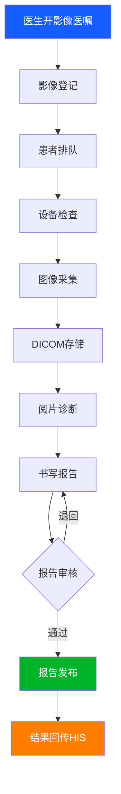

**影像检查状态机:**
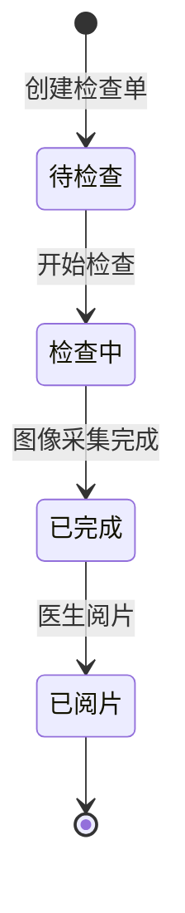

**实现:**
- 后端 Entity: `ImageStudy` → `pacs_image_study` 表
- 状态: 0-待检查, 1-检查中, 2-已完成, 3-已阅片
- 前端: `pacs/ImageManagement.vue` ✅, `pacs/ImageDiagnosis.vue` ❌ 待实现

---

## 五、收费流程

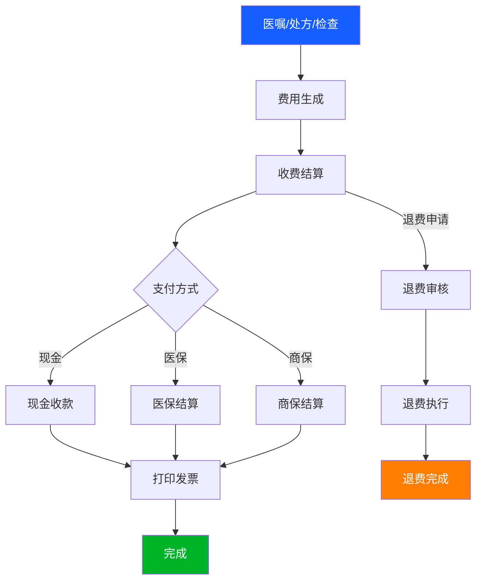

**前端页面（5 页已实现 UI）:**
| 页面 | 功能 |
|------|------|
| 收费结算 | 费用录入、结算、支付 |
| 退费管理 | 退费申请、审核、执行 |
| 结算查询 | 历史结算记录查询 |
| 日结交班 | 收费员日结对账 |
| 营收统计 | 科室/医生/时段营收分析 |

> ⚠️ 后端待实现

---

## 六、系统管理流程

### RBAC 权限流程

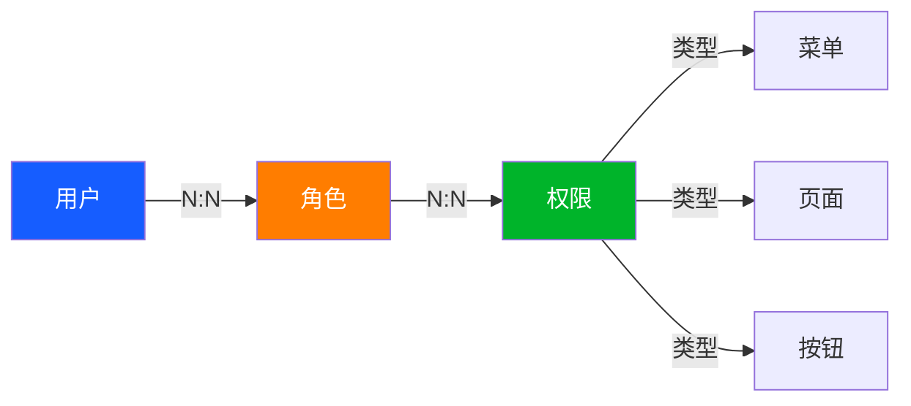

**预置角色:**
| 角色 | 角色码 | 权限范围 |
|------|--------|----------|
| 管理员 | ROLE_ADMIN | 全部权限 |
| 医生 | ROLE_DOCTOR | HIS业务 + 基础数据 + 住院 |
| 检验技师 | ROLE_LAB_TECH | LIS检验全部 |

**权限标识规范:** `模块:子模块:操作`
- 示例: `his:patient:view`, `charge:settle:view`, `lis:worklist:view`

---

## 七、业务模块与页面/表的对应关系

| 业务模块 | 页面 | 数据库表 | API文件 |
|----------|------|----------|---------|
| 患者管理 | PatientManagement | patient | patient.js |
| 挂号管理 | RegistrationManagement | registration | registration.js |
| 医生管理 | DoctorManagement | his_doctor | his.js |
| 住院登记 | AdmissionManagement | inpatient_admissions | inpatient.js |
| 影像管理 | ImageManagement | pacs_image_study | pacs.js |
| **电子病历** | **EmrManagement** | **emr_document + emr_audit_trail + emr_template** | **emr.js** |
| 科室管理 | DepartmentManagement | departments | base.js |
| 病房管理 | WardManagement | wards | base.js |
| 床位管理 | BedManagement | beds | base.js |
| 数据字典 | DictManagement | dict_types + dict_items | system.js |
| 用户管理 | UserManagement | users + user_roles | system.js |
| 角色管理 | RoleManagement | roles + role_permissions | system.js |
| 权限管理 | PermissionManagement | permissions | system.js |
| 审计日志 | AuditLogManagement | audit_log | system.js |
| 系统参数 | ParameterManagement | system_config | system.js |

---

## 八、电子病历流程 (EMR)

### 病历状态机

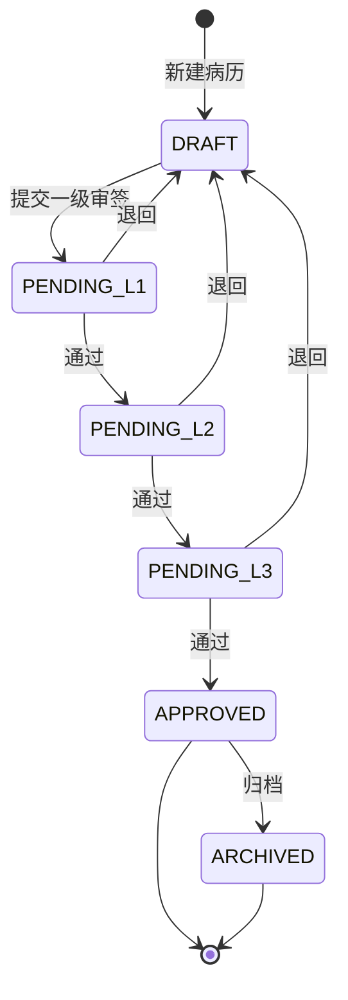

### 编辑流程

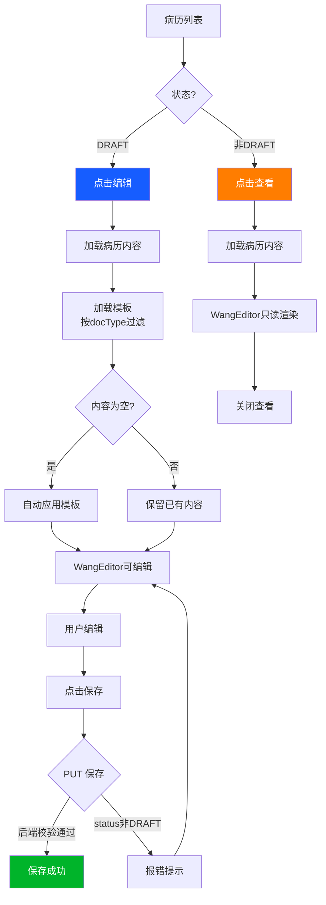

### 模板自动匹配规则

- 门诊病历 (OUTPATIENT_RECORD) → 门诊病历模板
- 入院记录 (ADMISSION_RECORD) → 入院记录模板  
- 病程记录 (PROGRESS_NOTE) → 日常病程记录模板
- 仅当日志内容为空（新建/未编辑）时自动应用模板内容
- 已有内容的病历只选中模板但不覆盖

### 审签流程

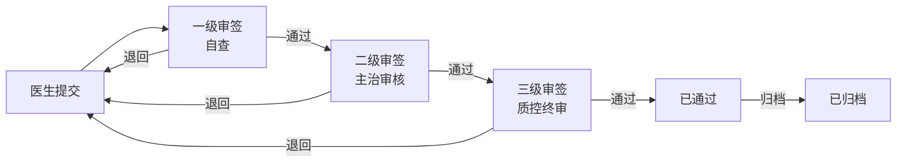

### 实现文件

- 前端: `frontend/src/views/emr/EmrManagement.vue` + `frontend/src/components/WangEditor.vue`
- API: `frontend/src/api/emr.js`
- 后端: `EmrDocumentController` → `EmrDocumentServiceImpl` → `EmrDocument` Entity
- 模板: `EmrTemplateController` → `EmrTemplateRepository.findAvailableTemplates()`
- 测试: `EmrDocumentServiceTest.java`（8个用例）

---

*相关文档: [[05_HIS_实际数据库表]] [[06_HIS_UI页面与路由]] [[08_HIS_数据流程]]*
*标签: #HIS #业务流程 #BPMN #Mermaid*
