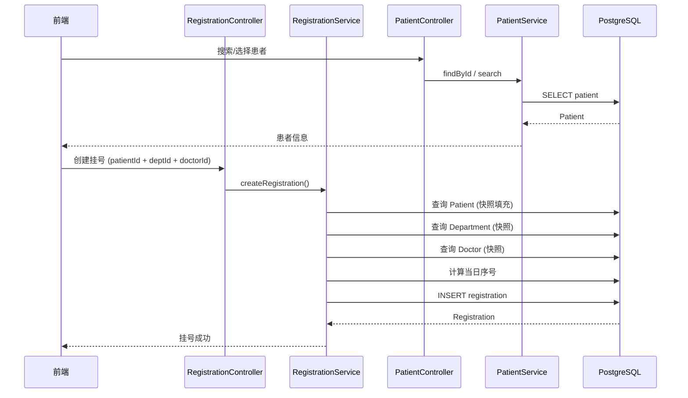
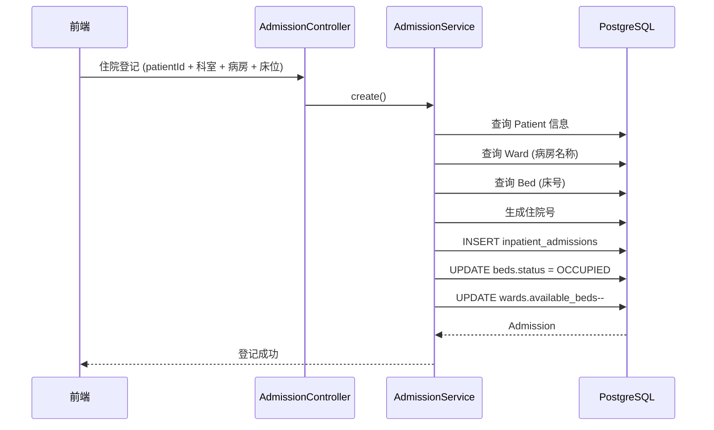
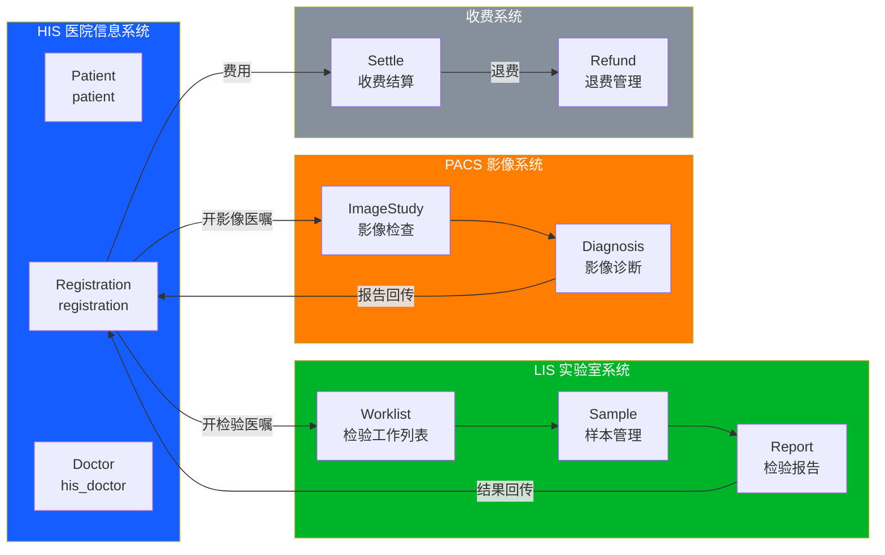
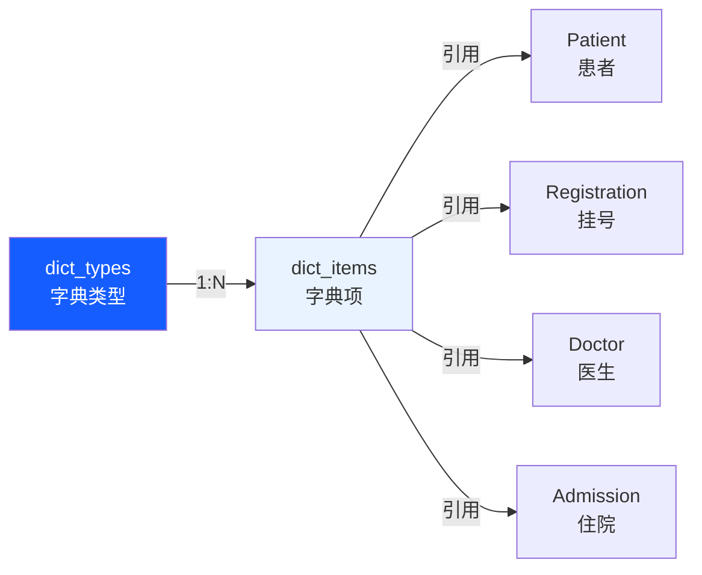
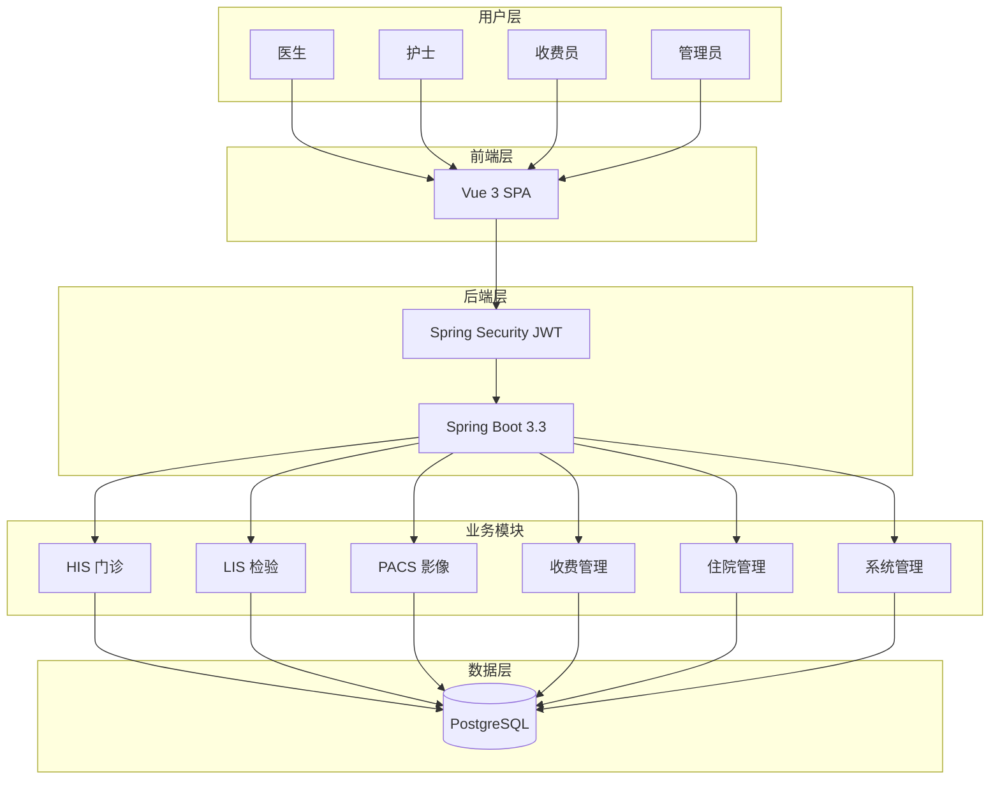

# HIS 数据流程

> 医院信息系统内部及系统间的数据流转关系
> 涵盖前端→后端→数据库、HIS→LIS→PACS 跨系统数据流

## 一、前端-后端-数据库 数据流

```mermaid
flowchart TD
    subgraph Frontend[前端 Vue 3]
        VP[页面组件<br>*.vue]
        VA[API 层<br>api/*.js]
        VS[状态管理<br>store/user.js]
        VR[路由守卫<br>router/index.js]
    end

    subgraph Backend[后端 Spring Boot]
        BC[Controller<br>@RestController]
        BS[Service<br>业务逻辑]
        BR[Repository<br>JPA Repository]
        BE[Entity<br>@Entity]
    end

    subgraph DB[PostgreSQL]
        T[(数据库表)]
    end

    VP -->|调用| VA
    VA -->|Axios HTTP| BC
    VS -->|token 注入| VA
    VR -->|权限检查| VS
    BC -->|注入| BS
    BS -->|调用| BR
    BR -->|JPA Query| BE
    BE -->|ORM映射| T
    BC -->|Result<T> JSON| VA

    style Frontend fill:#E8F3FF
    style Backend fill:#FFF3E8
    style DB fill:#E8FFE8
```

### 请求流程

```
用户操作 → Vue组件 → api/*.js (axios + token) → HTTP Request
    → Controller (@RequestMapping) → Service (业务逻辑)
    → Repository (JPA) → PostgreSQL → 返回结果
    → Controller (Result<T> 封装) → 前端渲染
```

### API 响应格式

```json
{
  "code": 200,
  "message": "success",
  "data": { ... }
}
```

---

## 二、核心数据流 — 挂号流程



**关键数据流:**
1. **患者快照**: Patient → Registration（16 个字段一次性冗余）
2. **科室/医生快照**: Department/Doctor → Registration（name + title）
3. **序号生成**: 按日期 + 科室自增

---

## 三、核心数据流 — 住院登记



**关键数据流:**
1. 住院登记 → 床位状态变更 (AVAILABLE → OCCUPIED)
2. 住院登记 → 病房可用床位数 -1
3. 出院 → 床位释放 (OCCUPIED → CLEANING → AVAILABLE)

---

## 四、跨系统数据流（HIS ↔ LIS ↔ PACS）



### 数据流转明细

| 流转方向 | 数据 | 协议 | 状态 |
|----------|------|------|:----:|
| HIS → LIS | 检验医嘱 (ORM消息) | HL7v2 / REST | ❌ 待实现 |
| LIS → HIS | 检验报告结果 | HL7v2 / REST | ❌ 待实现 |
| HIS → PACS | 影像医嘱 (ORM消息) | HL7v2 / REST | ❌ 待实现 |
| PACS → HIS | 影像报告结果 | HL7v2 / REST | ❌ 待实现 |
| HIS → 收费 | 费用明细 | REST API | ❌ 待实现 |
| 收费 → HIS | 结算状态 | REST API | ❌ 待实现 |

---

## 五、RBAC 权限数据流

```mermaid
flowchart TD
    A[用户登录] -->|username + password| B[AuthController]
    B -->|验证| C[AuthService]
    C -->|BCrypt| D[(users表)]
    D -->|查询| E[user_roles表]
    E -->|查询| F[(roles表)]
    F -->|查询| G[role_permissions表]
    G -->|查询| H[(permissions表)]
    H -->|返回| I[JWT Token]
    I -->|含权限列表| J[前端 store/user.js]
    J -->|路由守卫| K[hasPermission() 检查]
    J -->|菜单渲染| L[侧边栏动态菜单]

    style A fill:#165DFF,color:#fff
    style I fill:#00B42A,color:#fff
    style L fill:#FF7D00,color:#fff
```

**权限数据流:**
1. 登录 → 验证密码 → 查询角色 → 查询权限 → 生成 JWT
2. JWT 存储在 localStorage
3. Axios 拦截器自动注入 Authorization header
4. 路由守卫检查 `userStore.hasPermission(permission)`
5. 侧边栏根据权限动态渲染菜单

---

## 六、字典数据流



**字典应用场景:**
- 血型 (blood_type) → dict_items
- 民族 (ethnicity) → dict_items
- 婚姻状况 (marital_status) → dict_items
- 科室类型 (dept_type) → dict_items
- 床位类型 (bed_type) → dict_items

---

## 七、数据流总览图



---

*相关文档: [[05_HIS_实际数据库表]] [[06_HIS_UI页面与路由]] [[07_HIS_业务流程]] [[00_HIS_LIS_PACS_数据库ER图]]*
*标签: #HIS #数据流程 #数据流转 #Mermaid*
