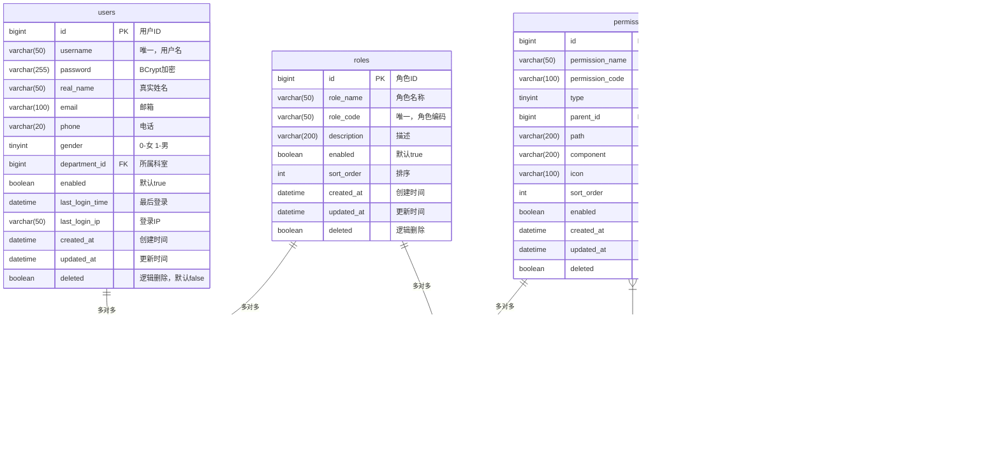
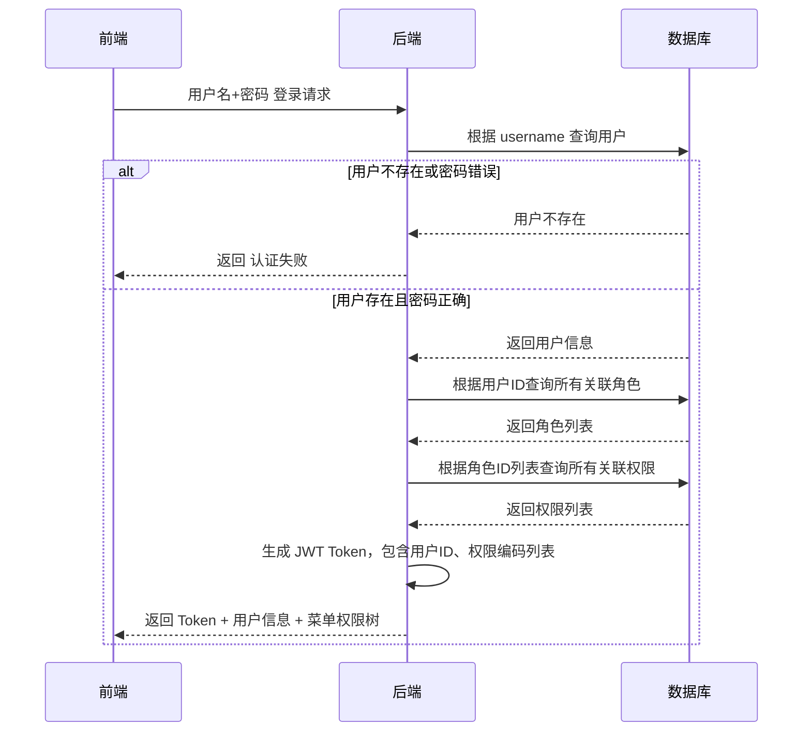
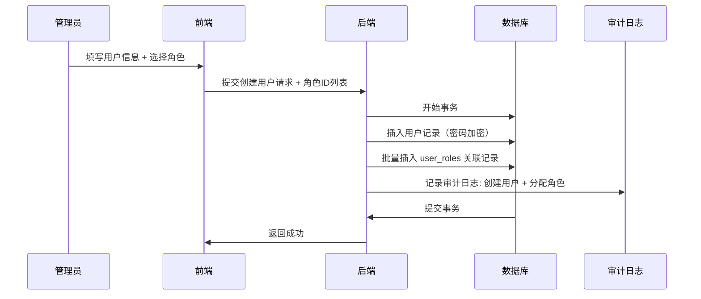
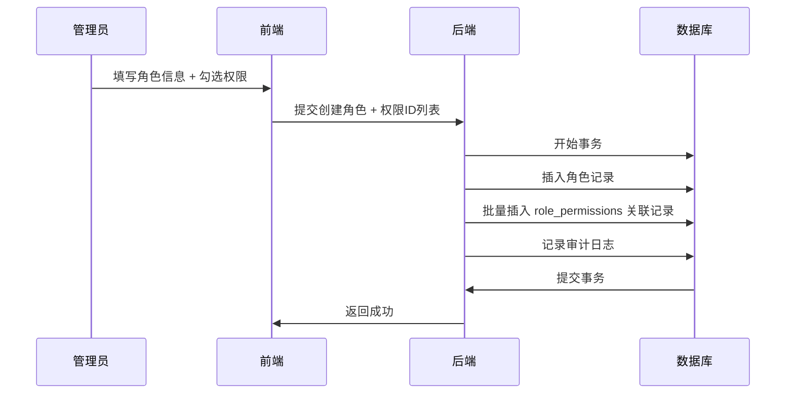
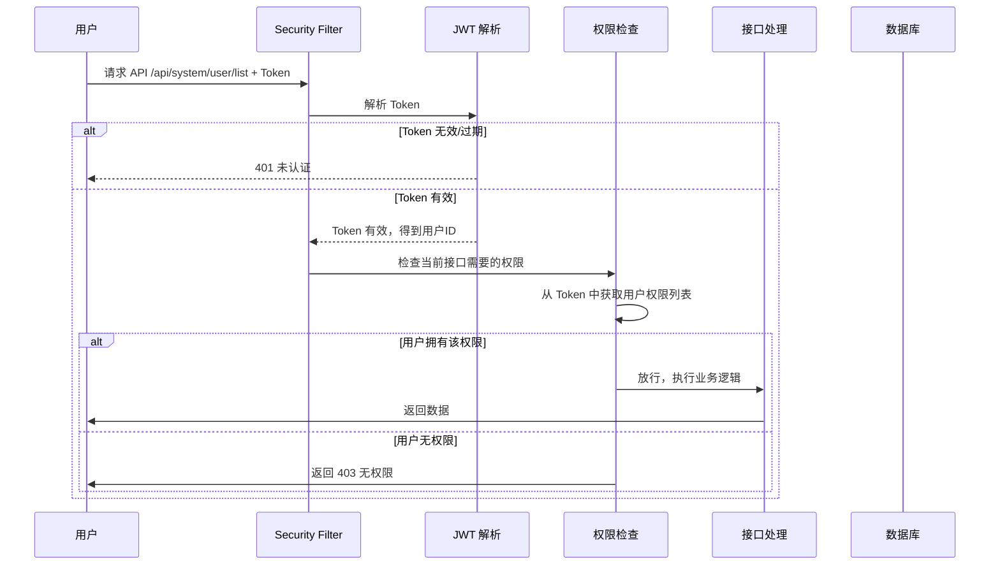

# 用户-角色-权限访问控制模块 — 详细设计文档

**项目**: HIS/LIS/PACS 医院信息系统  
**模块**: RBAC 基于角色的访问控制  
**合规要求**: 等保 2.0 三级  
**版本**: v1.0  
**日期**: 2026-04-24

---

## 目录

1. [架构设计](#1-架构设计)
2. [数据库表设计](#2-数据库表设计)
3. [ER 关系图](#3-er-关系图)
4. [核心业务流程](#4-核心业务流程)
5. [API 接口设计](#5-api-接口设计)
6. [等保 2.0 安全合规设计](#6-等保-20-安全合规设计)

---

## 1. 架构设计

### 1.1 RBAC 模型层次结构

```
┌─────────────────────────────────────────────────────────┐
│                    权限 (Permission)                      │
│  ┌──────────┐ ┌──────────┐ ┌──────────┐ ┌──────────┐   │
│  │菜单权限  │ │页面权限  │ │按钮权限  │ │数据权限  │   │
│  │(menu)    │ │(page)    │ │(button)  │ │(data)    │   │
│  └──────────┘ └──────────┘ └──────────┘ └──────────┘   │
└─────────────────────────────┬───────────────────────────┘
                              │ 多对多
                              ▼
┌─────────────────────────────────────────────────────────┐
│                     角色 (Role)                          │
│  例如: 超级管理员、系统管理员、科室主任、临床医生、护士  │
└─────────────────────────────┬───────────────────────────┘
                              │ 多对多
                              ▼
┌─────────────────────────────────────────────────────────┐
│                     用户 (User)                          │
│           实际使用系统的医院工作人员，关联科室            │
└─────────────────────────────────────────────────────────┘
```

### 1.2 权限粒度设计

| 权限类型 | 类型码 | 说明 | 示例 |
|---------|-------|------|------|
| 菜单权限 | 1 | 侧边栏菜单可见性 | 系统管理菜单、门诊管理菜单 |
| 页面权限 | 2 | 页面访问权限 | 用户管理页面、角色管理页面 |
| 按钮权限 | 3 | 页面内操作按钮控制 | 新增用户、删除用户、重置密码 |
| 数据权限 | 4 | 数据行级访问控制 | 仅查看本科室患者数据 |

### 1.3 数据权限范围

| 数据范围 | 范围码 | 说明 |
|---------|-------|------|
| 全部数据 | 1 | 可查看所有科室数据 |
| 本部门数据 | 2 | 仅可查看本科室数据 |
| 个人数据 | 3 | 仅可查看自己负责的数据 |

### 1.4 核心设计原则

1. **用户与角色**：多对多关系 — 一个用户可以拥有多个角色，一个角色可以被多个用户拥有
2. **角色与权限**：多对多关系 — 一个角色可以拥有多个权限，一个权限可以分配给多个角色
3. **权限与资源**：权限绑定到资源（菜单/按钮），支持动态配置
4. **权限继承**：不做复杂继承，保持简洁——用户权限 = 所有角色权限的并集

---

## 2. 数据库表设计

### 2.1 总览

共需要 **6 张表**：

| 表名 | 说明 |
|------|------|
| `users` | 用户表 |
| `roles` | 角色表 |
| `permissions` | 权限表 |
| `user_roles` | 用户-角色关联表（多对多） |
| `role_permissions` | 角色-权限关联表（多对多） |
| `permission_audit_log` | 权限审计日志表（等保合规） |

### 2.2 `users` 用户表

| 字段名 | 类型 | 约束 | 说明 |
|--------|------|------|------|
| `id` | BIGINT | PK, AUTO_INCREMENT | 用户ID |
| `username` | VARCHAR(50) | UNIQUE, NOT NULL | 登录用户名 |
| `password` | VARCHAR(255) | NOT NULL | 加密后的密码 |
| `real_name` | VARCHAR(50) | | 真实姓名 |
| `email` | VARCHAR(100) | | 邮箱 |
| `phone` | VARCHAR(20) | | 电话 |
| `gender` | TINYINT | | 性别: 0-女, 1-男 |
| `department_id` | BIGINT | FK | 所属科室ID |
| `enabled` | BOOLEAN | DEFAULT TRUE | 是否启用 |
| `last_login_time` | DATETIME | | 最后登录时间 |
| `last_login_ip` | VARCHAR(50) | | 最后登录IP |
| `created_at` | DATETIME | NOT NULL | 创建时间 |
| `updated_at` | DATETIME | NOT NULL | 更新时间 |
| `deleted` | BOOLEAN | DEFAULT FALSE | 逻辑删除 |

**索引**:
- 主键索引: `id`
- 唯一索引: `username`
- 普通索引: `department_id`

### 2.3 `roles` 角色表

| 字段名 | 类型 | 约束 | 说明 |
|--------|------|------|------|
| `id` | BIGINT | PK, AUTO_INCREMENT | 角色ID |
| `role_name` | VARCHAR(50) | NOT NULL | 角色名称 |
| `role_code` | VARCHAR(50) | UNIQUE, NOT NULL | 角色编码 |
| `description` | VARCHAR(200) | | 角色描述 |
| `enabled` | BOOLEAN | DEFAULT TRUE | 是否启用 |
| `sort_order` | INT | DEFAULT 0 | 排序 |
| `created_at` | DATETIME | NOT NULL | 创建时间 |
| `updated_at` | DATETIME | NOT NULL | 更新时间 |
| `deleted` | BOOLEAN | DEFAULT FALSE | 逻辑删除 |

**索引**:
- 主键索引: `id`
- 唯一索引: `role_code`

### 2.4 `permissions` 权限表

| 字段名 | 类型 | 约束 | 说明 |
|--------|------|------|------|
| `id` | BIGINT | PK, AUTO_INCREMENT | 权限ID |
| `permission_name` | VARCHAR(50) | NOT NULL | 权限名称 |
| `permission_code` | VARCHAR(100) | UNIQUE, NOT NULL | 权限编码（遵循 `module:type:action` 规范） |
| `type` | TINYINT | NOT NULL | 权限类型: 1-菜单, 2-页面, 3-按钮, 4-数据 |
| `parent_id` | BIGINT | FK | 父权限ID（构建树形结构） |
| `path` | VARCHAR(200) | | 路由路径（菜单/页面权限用） |
| `component` | VARCHAR(200) | | 前端组件路径 |
| `icon` | VARCHAR(100) | | 菜单图标 |
| `sort_order` | INT | DEFAULT 0 | 排序 |
| `enabled` | BOOLEAN | DEFAULT TRUE | 是否启用 |
| `created_at` | DATETIME | NOT NULL | 创建时间 |
| `updated_at` | DATETIME | NOT NULL | 更新时间 |
| `deleted` | BOOLEAN | DEFAULT FALSE | 逻辑删除 |

**权限编码规范示例**:

| 权限 | 编码 | 类型 |
|------|------|------|
| 系统管理菜单 | `system:menu:manage` | 1-菜单 |
| 用户管理页面 | `system:user:list` | 2-页面 |
| 新增用户按钮 | `system:user:create` | 3-按钮 |
| 删除用户按钮 | `system:user:delete` | 3-按钮 |
| 本科室数据 | `data:scope:department` | 4-数据 |

**索引**:
- 主键索引: `id`
- 唯一索引: `permission_code`
- 普通索引: `parent_id`
- 普通索引: `type`

### 2.5 `user_roles` 用户-角色关联表

| 字段名 | 类型 | 约束 | 说明 |
|--------|------|------|------|
| `id` | BIGINT | PK, AUTO_INCREMENT | 主键 |
| `user_id` | BIGINT | NOT NULL, FK | 用户ID |
| `role_id` | BIGINT | NOT NULL, FK | 角色ID |

**联合唯一约束**: `(user_id, role_id)` — 防止重复关联

**索引**:
- 主键索引: `id`
- 唯一索引: `(user_id, role_id)`
- 普通索引: `role_id`

### 2.6 `role_permissions` 角色-权限关联表

| 字段名 | 类型 | 约束 | 说明 |
|--------|------|------|------|
| `id` | BIGINT | PK, AUTO_INCREMENT | 主键 |
| `role_id` | BIGINT | NOT NULL, FK | 角色ID |
| `permission_id` | BIGINT | NOT NULL, FK | 权限ID |

**联合唯一约束**: `(role_id, permission_id)` — 防止重复关联

**索引**:
- 主键索引: `id`
- 唯一索引: `(role_id, permission_id)`
- 普通索引: `permission_id`

### 2.7 `permission_audit_log` 权限审计日志表（等保要求）

| 字段名 | 类型 | 约束 | 说明 |
|--------|------|------|------|
| `id` | BIGINT | PK, AUTO_INCREMENT | 日志ID |
| `user_id` | BIGINT | | 操作人ID |
| `username` | VARCHAR(50) | | 操作人用户名 |
| `action` | VARCHAR(50) | NOT NULL | 操作类型: grant-授权, revoke-收回, role-create-创建角色, permission-create-创建权限 |
| `target_type` | VARCHAR(20) | | 目标类型: user-用户, role-角色, permission-权限 |
| `target_id` | BIGINT | | 目标ID |
| `description` | VARCHAR(500) | | 操作描述 |
| `client_ip` | VARCHAR(50) | | 客户端IP |
| `created_at` | DATETIME | NOT NULL | 操作时间 |

**索引**:
- 主键索引: `id`
- 普通索引: `user_id`
- 普通索引: `created_at`

---

## 3. ER 关系图

完整的用户-角色-权限关系模型共包含 **6 张表**：



### 关系说明

| 表关系 | 基数 | 说明 |
|--------|------|------|
| `users` ↔ `roles` | **多对多** | 通过 `user_roles` 关联表连接 |
| `roles` ↔ `permissions` | **多对多** | 通过 `role_permissions` 关联表连接 |
| `permissions` ↔ `permissions` | **一对多** | 通过 `parent_id` 自连接，构建树形菜单 |

### 表关系总图

```
┌─────────┐        ┌──────────┐        ┌──────────────┐
│  users  │───────▶│user_roles│◀───────│    roles     │
└─────────┘        └──────────┘        └──────────────┘
                           │                    │
                           │                    └──────────┐
                           │                             ▼
                        ┌──────────────┐        ┌──────────────┐
                        │role_permissions│◀───────│ permissions  │
                        └──────────────┘        └──────────────┘
```

---

## 4. 核心业务流程

### 4.1 用户登录与权限获取流程



### 4.2 创建用户并分配角色流程



### 4.3 创建角色并分配权限流程



### 4.4 接口访问权限检查流程



**说明**: 权限检查在 JWT 中已经包含了用户的所有权限编码，不需要每次查询数据库，性能更好。

### 4.5 前端菜单过滤流程

1. 登录成功后，后端返回该用户所有权限列表
2. 前端根据权限类型 `type=1`（菜单权限）生成动态路由
3. 只生成用户有权限的菜单，隐藏无权限菜单
4. 对于按钮级权限（`type=3`），前端使用 `v-has-permission` 指令控制按钮显示隐藏

### 4.6 数据权限过滤流程

数据权限控制科室数据隔离：

1. 用户角色中包含数据权限范围（全部/本科室/个人）
2. 后端拦截查询请求，根据当前用户科室和数据权限范围自动添加查询条件
   - **全部数据**: 不添加过滤条件
   - **本科室数据**: `WHERE department_id = 当前用户科室ID`
   - **个人数据**: `WHERE create_by = 当前用户ID`
3. 对于临床场景，医生可以看到自己科室所有患者数据，但不能看到其他科室数据

---

## 5. API 接口设计

### 5.1 用户接口 `/api/system/user`

| 方法 | 路径 | 说明 | 权限 |
|------|------|------|------|
| GET | `/search` | 分页搜索用户 | `system:user:list` |
| GET | `/{id}` | 获取用户详情 | `system:user:view` |
| POST | `/` | 创建用户 | `system:user:create` |
| PUT | `/` | 更新用户 | `system:user:update` |
| DELETE | `/{id}` | 删除用户 | `system:user:delete` |
| PUT | `/resetPassword/{userId}` | 重置密码 | `system:user:resetPwd` |

### 5.2 角色接口 `/api/system/role`

| 方法 | 路径 | 说明 | 权限 |
|------|------|------|------|
| GET | `/search` | 分页搜索角色 | `system:role:list` |
| GET | `/list` | 获取所有角色 | 无（分配角色时使用） |
| GET | `/list-enabled` | 获取所有启用角色 | 无 |
| GET | `/{id}` | 获取角色详情 | `system:role:view` |
| POST | `/` | 创建角色 | `system:role:create` |
| PUT | `/` | 更新角色 | `system:role:update` |
| DELETE | `/{id}` | 删除角色 | `system:role:delete` |

### 5.3 权限接口 `/api/system/permission`

| 方法 | 路径 | 说明 | 权限 |
|------|------|------|------|
| GET | `/tree` | 获取权限树 | `system:permission:list` |
| GET | `/tree-enabled` | 获取启用权限树 | 无 |
| GET | `/{id}` | 获取权限详情 | `system:permission:view` |
| POST | `/` | 创建权限 | `system:permission:create` |
| PUT | `/` | 更新权限 | `system:permission:update` |
| DELETE | `/{id}` | 删除权限 | `system:permission:delete` |

### 5.4 用户-角色关联接口

- 创建用户时同时分配角色，不需要单独接口

---

## 6. 等保 2.0 安全合规设计

### 6.1 身份鉴别

- 用户身份唯一标识：用户名唯一
- 密码复杂度要求：至少8位，包含大小写字母和数字
- 登录失败处理：连续5次失败锁定账户15分钟
- 会话超时：30分钟无操作自动退出
- 超时自动退出：必须重新登录

### 6.2 访问控制

- 权限最小化原则：默认拒绝，需要显式授权才能访问
- 三级权限粒度：菜单 + 页面 + 按钮，实现细粒度控制
- 数据权限隔离：不同科室用户不能互访数据
- 超级管理员权限分离：系统管理员不做业务操作

### 6.3 安全审计

- 所有权限变更操作必须记录审计日志
- 审计日志包含：操作人、操作时间、客户端IP、操作内容、目标对象
- 审计日志至少保留 6 个月
- 审计日志不能被修改删除，只能查询

### 6.4 默认预置角色

| 角色名称 | 角色编码 | 说明 |
|----------|----------|------|
| 超级管理员 | `super_admin` | 拥有所有权限，系统初始化默认 |
| 系统管理员 | `system_admin` | 系统配置、用户角色权限管理 |
| 科室管理员 | `dept_admin` | 仅管理本科室用户 |

### 6.5 初始化数据

系统启动时自动初始化：
- 超级管理员用户 `admin` / 初始密码需要强制修改
- 预置基础权限菜单
- 超级管理员拥有所有权限

### 6.6 预置角色与权限分配示例

根据医院不同岗位，预置以下业务角色：

| 角色名称 | 角色编码 | 可访问模块 | 读权限 | 写权限 |
|----------|----------|-----------|--------|--------|
| **超级管理员** | `super_admin` | 全部模块 | ✅ 全部 | ✅ 全部 |
| **系统管理员** | `system_admin` | 系统管理（用户/角色/权限/科室/字典） | ✅ 全部 | ✅ 全部 |
| **科室主任** | `dept_director` | 本科室患者、医嘱、报告 | ✅ 本科室全部 | ✅ 本科室编辑 |
| **临床医生** | `doctor` | 门诊/住院患者、开立医嘱、查看报告 | ✅ 负责患者 | ✅ 开立医嘱、写病历 |
| **护士** | `nurse` | 患者信息、执行医嘱、护理记录 | ✅ 负责患者 | ✅ 执行医嘱、写护理记录 |
| **检验技师** | `lab_technician` | LIS检验模块、标本接收、审核报告 | ✅ 检验任务 | ✅ 录入结果、审核 |
| **影像技师** | `image_technician` | PACS影像模块、阅片、诊断报告 | ✅ 检查任务 | ✅ 写报告 |
| **财务收费员** | `cashier` | 收费模块、发票管理 | ✅ 收费数据 | ✅ 收费操作 |
| **医院院长** | `superintendent` | 全院统计报表、数据分析 | ✅ 全院数据 | ❌ 无写权限 |

### 6.7 读写权限控制设计

#### 6.7.1 权限与操作映射

在权限编码中体现读写：

| 资源 | 读权限编码 | 写权限编码 |
|------|-----------|-----------|
| 患者列表 | `his:patient:list` (读) | `his:patient:create` (写) |
| 医嘱管理 | `his:order:list` (读) | `his:order:create` (写) |
| 检验结果 | `lis:report:list` (读) | `lis:report:verify` (写) |

#### 6.7.2 读写控制层次

1. **按钮级控制**：前端根据写权限隐藏"新增/编辑/删除"按钮
2. **接口级控制**：后端接口检查对应写权限，非法直接返回 403
3. **数据级控制**：根据数据权限范围控制可读写的数据范围

#### 6.7.3 典型岗位读写权限示例

**护士角色**:
- 👁️ **读**: 可查看所负责患者的基本信息、医嘱
- ✍️ **写**: 可执行医嘱、记录护理记录，但不能修改医嘱
- ❌ **不能**: 不能修改医生开立的医嘱，不能删除患者记录

**医生角色**:
- 👁️ **读**: 可查看分管患者所有信息、检验检查报告
- ✍️ **写**: 可开立/修改医嘱、写病历、开检查申请
- ✅ 可以: 审核本科室报告

**检验技师**:
- 👁️ **读**: 可查看所有待检验标本和申请
- ✍️ **写**: 可录入检验结果、审核报告，不能修改申请信息
- ❌ **不能**: 不能修改临床医生开立的检验申请

---

## 总结

### 关系总结

- **用户 ↔ 角色**: 多对多 (`user_roles` 关联表)
- **角色 ↔ 权限**: 多对多 (`role_permissions` 关联表)
- **权限 ↔ 权限**: 一对多 (树形结构，`parent_id` 自关联)

### 关系图文字描述

```
用户 ──┐
       ├─┼─► 角色 ◄─┼─┐
用户 ──┘ │         │  └── 权限
        │         │
用户 ──┐ │         ┌── 权限
       └─┼─► 角色 ◄─┘
用户 ──┘
```

一个用户可以有多个角色，一个角色可以被分配给多个用户；
一个角色可以有多个权限，一个权限可以分配给多个角色。

