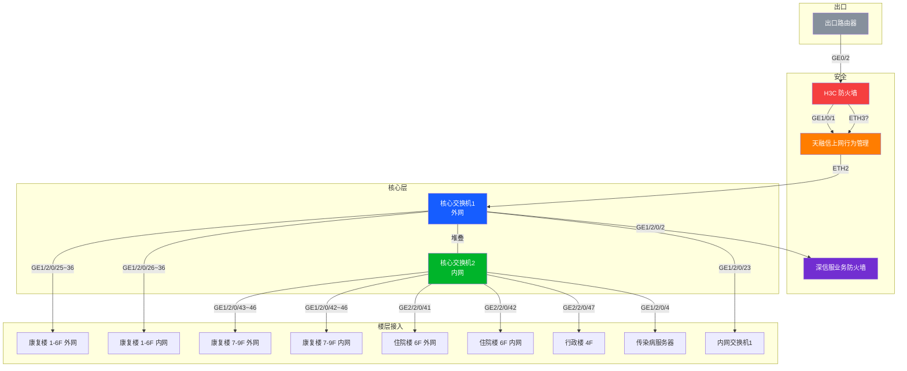

---
tags:
- 网络架构
- 端口映射
- 拓扑
- H3C堆叠
- 网络安全
- 医院/医保专网
date: 2026-04-30
related: "[[网络拓扑演进分析]]"
---

# 🔗 全网端口映射表（基于 Excel 源文件）

> ⚠️ **数据来源**：`设备端口映射.xlsx` — 工作表"内外网核心接口表"
> 本表为物理端口连接关系，是网络拓扑的精确描述。

---

## 1. 出口链路

| 本端设备 | 端口 | 对端 | 备注 |
|:---------|:----|:-----|:-----|
| **出口路由器** | GE0/0 | 财务专线2 | — |
| | GE0/1 | 财务专线1 | — |
| | GE0/2 | H3C 防火墙 → GE0/4 | — |

## 2. 安全设备

| 本端设备 | 端口 | 对端 | 端口 |
|:---------|:----|:-----|:-----|
| **H3C 防火墙** | GE1/0/1 | 天融信上网行为管理 | ETH3 |
| | GE1/0/4 | 出口路由器 | GE0/2 |
| **天融信上网行为管理** | ETH2 | 核心交换机1（外网） | GE1/2/0/24 |
| | ETH3 | H3C 防火墙 | GE1/0/1 |
| **深信服业务防火墙** | ETH1 | 核心交换机1（外网） | GE1/2/0/2 |

## 3. 核心交换机堆叠

> 两台核心交换机通过 IRF/堆叠技术互联，形成双机架构。

| 本端设备 | 端口 | 对端设备 | 端口 | 用途 |
|:---------|:----|:---------|:----|:-----|
| **核心交换机1（外网）** | GE1/2/0/1 | 核心交换机2（内网） | GE2/2/0/1 | 堆叠新心跳线 |
| | XGE1/2/0/40 | 核心交换机2（内网） | XGE2/2/0/40 | 堆叠 |

### 核心交换机1（外网）—— 下行端口明细

| 端口 | 对端设备 | 对端端口 | 用途 |
|:----|:---------|:--------|:-----|
| GE1/2/0/2 | 深信服业务防火墙 | ETH1 | 服务器区接入 |
| GE1/2/0/3~22 | — | — | ⚪ 空闲 |
| GE1/2/0/23 | 内网交换机1 | GE1/0/22 | 内网下行 |
| GE1/2/0/24 | 天融信上网行为管理 | ETH2 | 行为管理上行 |
| **GE1/2/0/25** | 康复楼-1F-**外网**接入交换机 | GE1/0/29 | |
| **GE1/2/0/26** | 康复楼-1F-**内网**接入交换机 | GE1/0/29 | |
| **GE1/2/0/27** | 康复楼-2F-**外网**接入交换机 | GE1/0/29 | |
| **GE1/2/0/28** | 康复楼-2F-**内网**接入交换机 | GE1/0/29 | |
| **GE1/2/0/29** | 康复楼-3F-**外网**接入交换机 | GE1/0/29 | |
| **GE1/2/0/30** | 康复楼-3F-**内网**接入交换机 | GE1/0/29 | |
| **GE1/2/0/31** | 康复楼-4F-**外网**接入交换机 | GE1/0/29 | |
| **GE1/2/0/32** | 康复楼-4F-**内网**接入交换机 | GE1/0/29 | |
| **GE1/2/0/33** | 康复楼-5F-**外网**接入交换机 | GE1/0/29 | |
| **GE1/2/0/34** | 康复楼-5F-**内网**接入交换机 | GE1/0/29 | |
| **GE1/2/0/35** | 康复楼-6F-**外网**接入交换机 | GE1/0/29 | |
| **GE1/2/0/36** | 康复楼-6F-**内网**接入交换机 | GE1/0/29 | |
| XGE1/2/0/37~39 | — | — | ⚪ 空闲（万兆） |
| **XGE1/2/0/40** | 核心交换机2（内网） | XGE2/2/0/40 | 堆叠（万兆） |
| **GE1/2/0/41** | 康复楼-7F-**外网**接入交换机 | GE1/0/29 | |

### 核心交换机2（内网）—— 下行端口明细

| 端口             | 对端设备               | 对端端口        | 用途       |
| :------------- | :----------------- | :---------- | :------- |
| GE1/2/0/4      | 传染病服务器             | 未知          | 服务器接入    |
| **GE1/2/0/42** | 康复楼-7F-**内网**接入交换机 | GE1/0/29    |          |
| **GE1/2/0/43** | 康复楼-8F-**外网**接入交换机 | GE1/0/29    |          |
| **GE1/2/0/44** | 康复楼-8F-**内网**接入交换机 | GE1/0/29    |          |
| **GE1/2/0/45** | 康复楼-9F-**外网**接入交换机 | GE1/0/29    |          |
| **GE1/2/0/46** | 康复楼-9F-**内网**接入交换机 | GE1/0/29    |          |
| GE1/2/0/47~48  | —                  | —           | ⚪ 空闲     |
| GE2/2/0/1      | 核心交换机1（外网）         | GE1/2/0/1   | 堆叠新心跳线   |
| GE2/2/0/2~36   | —                  | —           | ⚪ 空闲     |
| XGE1/2/0/37~39 | —                  | —           | ⚪ 空闲（万兆） |
| XGE2/2/0/40    | 核心交换机1（外网）         | XGE1/2/0/40 | 堆叠（万兆）   |
| **GE2/2/0/41** | 住院楼6楼**外网**汇聚交换机   | GE1/0/49    |          |
| **GE2/2/0/42** | 住院楼6楼**内网**汇聚交换机   | GE1/0/45    |          |
| GE2/2/0/43~46  | —                  | —           | 空闲       |
| **GE2/2/0/47** | 行政楼4楼汇聚交换机         | GE1/0/26    |          |
| GE2/2/0/48     | —                  | —           | ⚪ 空闲     |

---

## 4. 楼层接入总览

### 康复楼（9层，每层外网+内网双接入）

| 楼层 | 外网接入交换机 → 核心 | 内网接入交换机 → 核心 |
|:----:|:--------------------|:--------------------|
| 1F | 核心1 GE1/2/0/25 | 核心1 GE1/2/0/26 |
| 2F | 核心1 GE1/2/0/27 | 核心1 GE1/2/0/28 |
| 3F | 核心1 GE1/2/0/29 | 核心1 GE1/2/0/30 |
| 4F | 核心1 GE1/2/0/31 | 核心1 GE1/2/0/32 |
| 5F | 核心1 GE1/2/0/33 | 核心1 GE1/2/0/34 |
| 6F | 核心1 GE1/2/0/35 | 核心1 GE1/2/0/36 |
| 7F | 核心1 GE1/2/0/41 | 核心2 GE1/2/0/42 |
| 8F | 核心2 GE1/2/0/43 | 核心2 GE1/2/0/44 |
| 9F | 核心2 GE1/2/0/45 | 核心2 GE1/2/0/46 |

> **注意**：1-6F 外网接入挂核心1，7-9F 外网接入挂核心2，未跨堆叠负载均衡。

### 住院楼

| 楼层 | 汇聚交换机 | 核心端口 | 对端端口 |
|:----:|:----------|:---------|:---------|
| 6F | **外网**汇聚 | 核心2 GE2/2/0/41 | GE1/0/49 |
| 6F | **内网**汇聚 | 核心2 GE2/2/0/42 | GE1/0/45 |

### 行政楼

| 楼层 | 汇聚交换机 | 核心端口 | 对端端口 |
|:----:|:----------|:---------|:---------|
| 4F | 汇聚交换机 | 核心2 GE2/2/0/47 | GE1/0/26 |

---

## 5. 拓扑架构图

---

## 6. ⚠️ 与之前笔记的差异说明

| 项 | 之前笔记（推测） | 实际（Excel） | 实际（设备配置） |
|:---|:----------------|:-------------|:-----------------|
| 核心交换机 | 单台 IRF 堆叠 | 核心1外网+核心2内网 | ✅ **同一IRF域** member1+2，40口万兆堆叠 |
| H3C 防火墙 | 未明确型号 | 明确为 H3C 防火墙 | 确认 H3C 防火墙 GE0/4 连路由器 |
| 出口链路 | Port 3/5/6 接各专线 | GE0/0 财务2 / GE0/1 财务1 / GE0/2→防火墙 | ✅ GE0/0=互联网 / GE0/1=财务备线 |
| 医保专网 | 路由直接接，绕过防火墙 | 未显示医保直连 | 实际 GE0/4=民政专线，GE0/3=新农合 |
| 康复楼楼层 | 1-9楼统一 | 1-6F挂核心1，7-9F挂核心2 | ✅ 1-6F=核心member1, 7-9F=核心member2 |
| 万兆口 | 未提及 | 标注空闲 | ✅ XGE1/2/0/37-39已配Trunk, 40为堆叠口 |

> 📌 **数据可靠度**: 设备配置 > Excel 端口表 > 人工描述拓扑图。本文档已根据设备配置和Excel交叉验证更新。

---

*相关文档: [[网络拓扑演进分析]] | [[核心交换机配置分析]] | [[出口路由器配置分析]]*
*标签: #网络架构 #端口映射 #拓扑 #H3C堆叠 #网络安全*
