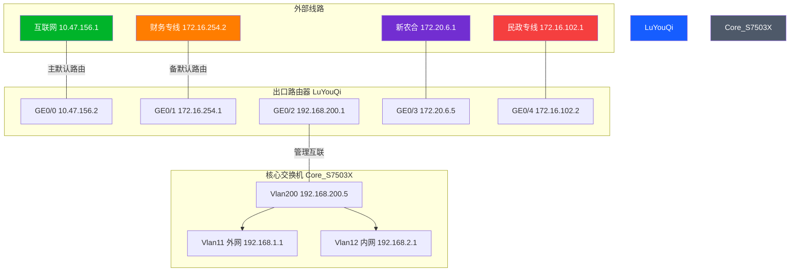

---
tags:
- 网络架构
- 配置文档
- 设备运行
- 出口路由器
- 策略路由
- NAT
- H3C
date: 2026-04-30
related: "[[核心交换机配置分析]]"
---

# 出口路由器配置分析

> **设备**: H3C 路由器 | **设备名**: LuYouQi
> **版本**: 7.1.064, Release 6749P21
> **来源**: 设备导出配置 `出口路由器.txt`

---

## 1. 端口与 IP 分配

| 端口 | IP 地址 | 子网 | 对端/线路 | 说明 |
|:----|:--------|:---|:----------|:-----|
| **GE0/0** | `10.47.156.2` | /25 | **互联网出口** | 默认路由 10.47.156.1 + NAT |
| **GE0/1** | `172.16.254.1` | /30 | **财务专线** | 备份路由 172.16.254.2 |
| **GE0/2** | `192.168.200.1` | /24 | **核心交换机 Vlan200** | 内外网互联 + 财务策略路由 |
| **GE0/3** | `172.20.6.5` | /24 | **新农合专线** | description: xinnonghe |
| **GE0/4** | `172.16.102.2` | /24 | **民政/医保专线** | description: mingzheng |
| **GE0/5** | `10.255.255.1` | /24 | 未知内部链路 | — |

---

## 2. 路由策略

### 2.1 默认路由

```text
ip route-static 0.0.0.0 0 10.47.156.1             # 主：互联网（preference 60）
ip route-static 0.0.0.0 0 172.16.254.2 preference 80  # 备：财务专线
```

- 正常情况下所有流量走 GE0/0（互联网）
- 互联网断线时自动切换至财务专线（preference 80 更高 → 优先级更低）

### 2.2 静态路由

| 目标网段 | 下一跳 | 说明 |
|:---------|:-------|:-----|
| 10.18.1.10/32 | 172.16.102.1 | 民政专线目标 |
| 10.18.1.17/32 | 172.16.102.1 | 同上 |
| 10.18.1.18/32 | 172.16.102.1 | 同上 |
| 10.18.1.30/32 | 172.16.102.1 | 同上 |
| 172.20.0.0/16 | 172.20.6.1 | 新农合专线 |
| 192.168.1.0/24 | 192.168.200.5 | 回指核心交换机外网段 |
| 192.168.2.0/24 | 192.168.200.5 | 回指核心交换机内网段 |
| 192.168.3~8.0/24 | 192.168.200.5 | 回指核心交换机 |
| 192.168.10.0/24 | 192.168.200.5 | 回指监控网段 |

### 2.3 策略路由（PBR）

```text
# 测试用策略（源IP 192.168.1.250 走特殊线路）
policy-based-route TEST permit node 5
 if-match acl 3001          # 匹配源 192.168.1.250
 apply next-hop 171.108.224.161   # 走特殊路由

policy-based-route TEST permit node 10
 apply next-hop 10.47.156.1       # 其他走互联网

# 财务策略（特定终端走财务专线）
policy-based-route caiwu permit node 10
 if-match acl 3110          # 匹配财务终端
 apply next-hop 172.16.254.2      # 走财务专线
```

**策略路由挂载**：GE0/2（连核心交换机入口）应用 `policy-based-route caiwu`

---

## 3. 财务专线终端（ACL 3110）

| IP 地址 | 说明 |
|:--------|:-----|
| 192.168.1.134 | 财务终端1 |
| 192.168.1.135 | 财务终端2 |
| 192.168.1.153 | 财务终端3 |
| 192.168.1.152 | 财务终端4 |

> 以上 4 台终端流量进入路由器时，根据 GE0/2 入口的策略路由 `caiwu`，自动匹配 ACL 3110，下一跳指向财务专线。

---

## 4. NAT 配置

### ACL 3010（NAT 白名单）

| 规则 | 源地址 | 说明 |
|:----|:-------|:-----|
| 0 | 192.168.1.0/24 | 外网段 |
| 5 | 192.168.2.240 | 内网特定IP |
| 10 | 172.16.255.0/24 | VPN/远程接入段 |
| 15 | 192.168.3.0/24 | 扩展段 |
| 20 | 192.168.4.0/24 | 扩展段 |
| 25 | 192.168.5.0/24 | 扩展段 |
| 30 | 192.168.6.0/24 | 扩展段 |

**NAT Outbound 挂载端口**:
- GE0/0（主互联网出口）
- GE0/3（新农合）
- GE0/4（民政专线）

> 只允许 ACL 3010 内的源地址做 NAT 转换。

---

## 5. 其他关键配置

### DNS
```text
dns proxy enable
dns server 202.103.224.68     # 主 DNS
dns server 202.103.225.68     # 备 DNS
```

### SSH
```text
ssh server enable
local-user admin class manage
  service-type ssh telnet http
local-user h3c class manage
  service-type ssh telnet
```

### 密码策略
```text
password-control enable
password-control login-attempt 3 exceed lock-time 10  # 3次失败锁定10分钟
```

---

## 6. 网络拓扑简化图



---

## 7. 风险与建议

### 7.1 策略路由绑定位置

`policy-based-route caiwu` 挂在 **GE0/2 入口**（核心交换机方向）。这意味着财务终端的流量从核心交换机→路由器时，**在入口处**触发策略路由。如果财务终端走其他出口（如 VPN、无线），策略不生效。

### 7.2 未使用的万兆口

GE0/6 ~ GE0/9（千兆）和 XGE0/10 ~ 0/15（万兆）全部未配置。预留了扩展能力。

### 7.3 NAT 白名单

ACL 3010 中 **内网段 192.168.2.0/24 仅允许了 .2.240 一台**做 NAT。内网终端默认无法上网，符合安全隔离设计。

### 7.4 静态路由中的公网IP

```text
ip route-static 195.4.20.0 24 192.168.200.99
ip route-static 197.4.20.0 24 192.168.200.99
ip route-static 200.200.200.0 24 192.168.200.99
```

这 3 条路由将公网 IP 段指向内网地址 192.168.200.99，可能是**内部映射公网IP** 或 **专线回指路由**。需要确认 .200.99 是什么设备。

---

*相关文档: [[核心交换机配置分析]] | [[全网端口映射表]]*
*标签: #网络架构 #配置文档 #出口路由器 #策略路由 #NAT #H3C*
