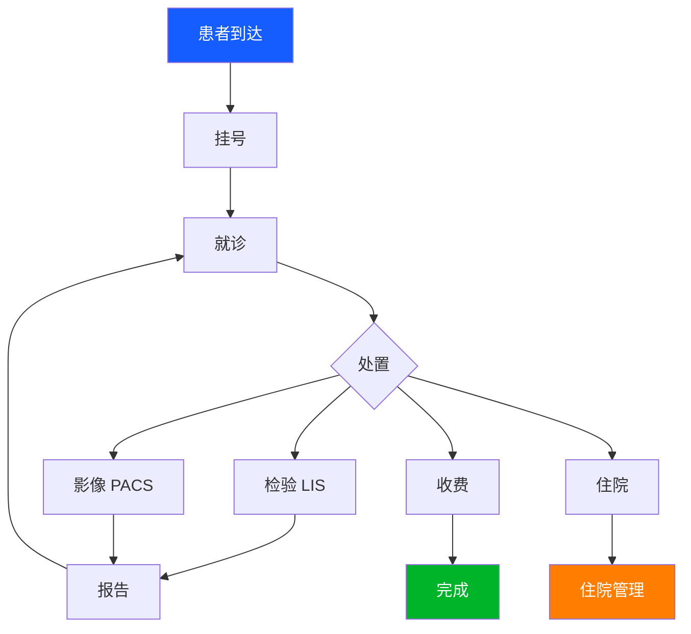
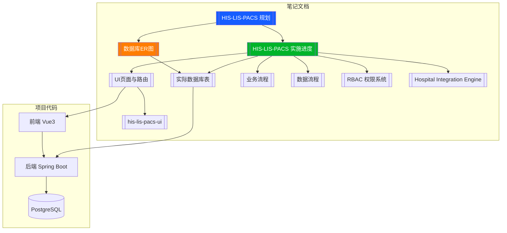

# HIS/LIS/PACS 实施进度

> 医院信息系统从规划到落地的实施追踪
> 规划文档见 [[HIS-LIS-PACS 规划]]

## 项目概况

| 项 | 值 |
|----|-----|
| 前端 | Vue 3 + Vite + Element Plus + Pinia |
| 后端 | Spring Boot 3.3 + Spring Data JPA + Security JWT |
| 数据库 | PostgreSQL (Docker) |
| 前端端口 | 3000 |
| 后端端口 | 8080 |

## 模块进度

### ✅ 已完成

| 模块 | 前端 | 后端 | 备注 |
|------|:----:|:----:|------|
| 登录认证 | ✅ | ✅ | JWT + 多角色 |
| 仪表盘 | ✅ | — | 静态 |
| 用户管理 | ✅ | ✅ | CRUD + 科室树 |
| 角色管理 | ✅ | ✅ | RBAC |
| 权限管理 | ✅ | ✅ | 44 条预置 |
| 患者管理 | ✅ | ✅ | CRUD + 搜索 |
| 医生管理 | ✅ | ✅ | CRUD + 科室筛选 |
| 挂号管理 | ✅ | ✅ | 四步流程 + 患者快照 |
| 科室管理 | ✅ | ✅ | 基础数据 |
| 病房管理 | ✅ | ✅ | 基础数据 |
| 床位管理 | ✅ | ✅ | 基础数据 |
| 住院登记 | ✅ | ✅ | |
| 数据字典 | ✅ | ✅ | |
|| 影像管理 | ✅ | ✅ | ImageStudy |
|| 电子病历 | ✅ | ✅ | 三级质控 + 模板 + 归档 |

### ⏳ 待完成

| 模块 | 前端 | 后端 | 备注 |
|------|:----:|:----:|------|
| 检验工作列表 | ✅ | ❌ | LIS |
| 样本管理 | ✅ | ❌ | LIS |
| 检验项目 | ✅ | ❌ | LIS |
| 检验报告 | ✅ | ❌ | LIS |
| 收费管理 | ✅ | ❌ | |
| 系统设置 | ✅ | ❌ | |
| 审计日志 | ✅ | ❌ | |
| 参数配置 | ✅ | ❌ | |
| 影像诊断 | ✅ | ❌ | PACS |

## 预设角色

| 角色 | 角色码 | 权限范围 |
|------|--------|----------|
| 管理员 | ROLE_ADMIN | 全部 |
| 医生 | ROLE_DOCTOR | HIS 业务 + 基础数据 + 住院 |
| 检验技师 | ROLE_LAB_TECH | LIS 检验全部 |

详见 [[RBAC 权限系统]]

## 相关对话

- [[conversations/2026-04-28/17-30_HIS-RBAC-开发|2026-04-28 HIS 患者+挂号+RBAC]]
- [[conversations/2026-04-23/ 系列对话]]
- [[conversations/2026-04-22/ 系列对话]]

## 数据库表清单

基于 JPA Entity 的实际数据库表（15 个 Entity → 17 张表）

| 分类 | 表 | Entity | 状态 |
|------|-----|--------|:----:|
| 门诊 | patient | Patient | ✅ |
| 门诊 | registration | Registration | ✅ |
| 门诊 | his_doctor | Doctor | ✅ |
| 影像 | pacs_image_study | ImageStudy | ✅ |
| 住院 | inpatient_admissions | Admission | ✅ |
| 基础 | departments | Department | ✅ |
| 基础 | wards | Ward | ✅ |
| 基础 | beds | Bed | ✅ |
| 基础 | dict_types + dict_items | DictType + DictItem | ✅ |
| 系统 | users + user_roles | User | ✅ |
| 系统 | roles + role_permissions | Role | ✅ |
| 系统 | permissions | Permission | ✅ |
| 系统 | system_config | SystemConfig | ✅ |
| 系统 | audit_log | AuditLog | ✅ |

详见 [[05_HIS_实际数据库表]]

## UI 页面清单

33 个 Vue 组件，27 个路由页面，8 个 API 模块

| 模块 | 页面数 | 路由 | 后端 |
|------|:------:|:----:|:----:|
| HIS 门诊 | 3 | ✅ | ✅ |
| 收费管理 | 5 | ✅ | ❌ |
| LIS 检验 | 4 | ✅ | ❌ |
| PACS 影像 | 2 | ✅ | 部分 |
| 住院管理 | 1 | ✅ | ✅ |
| 基础配置 | 5 | ✅ | ✅ |
| 系统管理 | 7 | ✅ | 部分 |

详见 [[06_HIS_UI页面与路由]]

## 业务流程概览

详见 [[07_HIS_业务流程]] [[08_HIS_数据流程]]

## 系统关系图谱

## 关联

- [[HIS-LIS-PACS 规划]] — 架构规划
- [[RBAC 权限系统]] — 权限设计
- [[Hospital Integration Engine]] — 集成平台
- [[05_HIS_实际数据库表]] — JPA Entity 映射
- [[06_HIS_UI页面与路由]] — 前端页面清单
- [[07_HIS_业务流程]] — 业务流程图
- [[08_HIS_数据流程]] — 数据流转图
- [[00_HIS_LIS_PACS_数据库ER图]] — ER 图总览
- [[09_EMR_电子病历设计]] — EMR 模块设计
