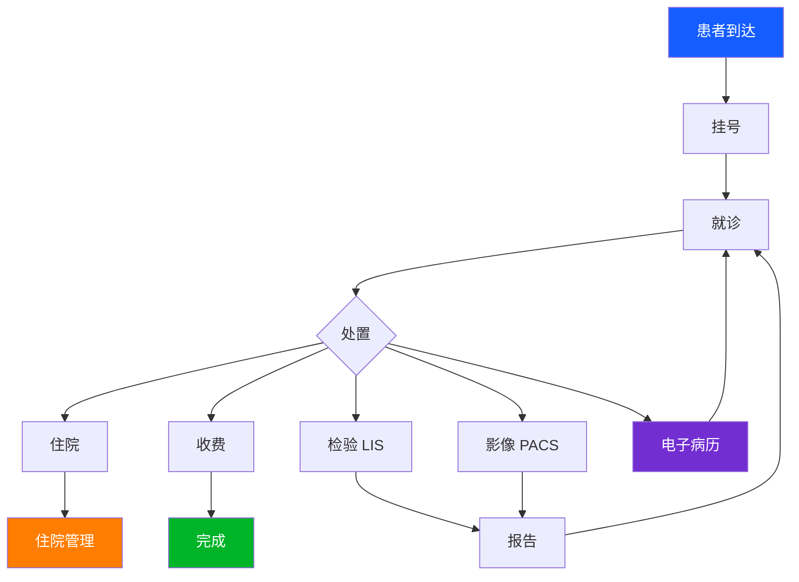
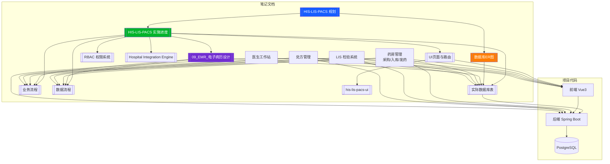

# HIS/LIS/PACS 实施进度

> 医院信息系统从规划到落地的实施追踪
> 规划文档见 [[HIS-LIS-PACS 规划]]

## 项目概况

| 项 | 值 |
|----|-----|
| 前端 | Vue 3 + Vite + Element Plus + Pinia |
| 后端 | Spring Boot 3.3 + Spring Data JPA + Security JWT |
| 数据库 | PostgreSQL (Docker) |
| 前端端口 | 3000 |
| 后端端口 | 8080 |

## 模块进度

### ✅ 已完成

| 模块 | 前端 | 后端 | 备注 |
|------|:----:|:----:|------|
| 登录认证 | ✅ | ✅ | JWT + 多角色 |
| 仪表盘 | ✅ | — | 静态 |
| 用户管理 | ✅ | ✅ | CRUD + 科室树 |
| 角色管理 | ✅ | ✅ | RBAC |
| 权限管理 | ✅ | ✅ | 44 条预置 |
| 患者管理 | ✅ | ✅ | CRUD + 搜索 |
| 医生管理 | ✅ | ✅ | CRUD + 科室筛选 |
| 挂号管理 | ✅ | ✅ | 四步流程 + 患者快照 |
| 科室管理 | ✅ | ✅ | 基础数据 |
| 病房管理 | ✅ | ✅ | 基础数据 |
| 床位管理 | ✅ | ✅ | 基础数据 |
| 住院登记 | ✅ | ✅ | |
| 数据字典 | ✅ | ✅ | |
| 影像管理 | ✅ | ✅ | ImageStudy |
|| **电子病历(EMR)** | ✅ | ✅ | 三级质控 + 模板 + 归档 |
|| **药房管理** | ✅ | ✅ | 药品目录+采购入库+批次库存+变动记录 |
|| **LIS 检验系统** | ✅ | ✅ | 检验项目+申请+样本+结果+报告 |
|| **处方模块** | ✅ | ✅ | 处方创建+明细+状态流转 |

### ⏳ 待完成

| 模块 | 前端 | 后端 | 备注 |
|------|:----:|:----:|------|
| 收费管理 | ✅ | ❌ | |
| 系统设置 | ✅ | ❌ | |
| 审计日志 | ✅ | ❌ | |
| 参数配置 | ✅ | ❌ | |
|| 影像诊断 | ✅ | ❌ | PACS |

### ✅ 新增（2026-04-30 完成）

| 模块 | 前端 | 后端 | 备注 |
|------|:----:|:----:|------|
| **药房管理** | ✅ | ✅ | 6张表，30个后端文件，完整采购/入库/发药FIFO |
| **LIS 检验系统** | ✅ | ✅ | 6张表，17个后端文件，完整检验流程 |
| **处方模块** | ✅ | ✅ | 2张表，5个后端文件，DRAFT→PAID→DISPENSED |
| **医生工作站** | ✅ | ✅ | 诊间候诊+病历/处方/检验一体化 |
| **权限（药房+LIS+处方）** | — | ✅ | 20条新权限 |

## EMR 电子病历模块详情（2026-04-29 更新）

### 前端改动
- **WangEditor 升级**: content 存储为 HTML，支持字体/大小/加粗/段落/列表
- **CSS 强制左对齐**: 编辑器内所有元素 text-align: left !important
- **模板自动匹配**: 门诊→门诊模板，住院→入院模板，仅空文档自动应用
- **编辑/查看分离**: DRAFT→编辑(可编辑+可保存)，非DRAFT→查看(只读渲染)
- **错误提示改进**: 显示后端真实错误消息替代通用"保存失败"
- **只读模式**: WangEditor 新增 readonly prop，调用 editor.disable()

### 后端改动
- **保存校验**: PUT /api/emr/documents/{id} 校验 status==DRAFT，否则抛异常
- **模板过滤**: GET /api/emr/templates?docType= 按病历类型过滤

### 自动化测试
- **8 个测试用例**: 正常保存、长文本、非草稿禁止编辑、不存在的ID、空内容、空白HTML、多次覆盖、退回后重编辑
- 使用 H2 内存库，MODE=PostgreSQL 兼容

## 药房管理模块详情（2026-04-30 新增）

### 数据库设计（6张表）

| 表名 | 说明 | Entity |
|------|------|--------|
| drug_catalog | 药品目录（基本信息、价格） | DrugCatalog |
| drug_stock_batch | 库存批次（批次号、有效期、数量） | DrugStockBatch |
| drug_stock_movement | 库存变动记录（入库/发药/调整） | DrugStockMovement |
| drug_purchase_order | 采购订单主表 | DrugPurchaseOrder |
| drug_purchase_item | 采购订单明细 | DrugPurchaseItem |
| dispensing_record | 发药记录（FIFO批次扣减） | DispensingRecord |

### 业务流程

1. **药品目录管理**: 新增/编辑/启停药品信息
2. **采购入库**: 创建订单(DRAFT) → 提审(PENDING_APPROVAL) → 审核(APPROVED) → 入库(COMPLETED，自动批次+库存变动)
3. **发药(FIFO)**: 处方 → 按效期优先选批次 → 扣库存 → 创建发药记录
4. **库存追溯**: 每批次采购价、零售价、有效期全程追踪

### 实现文件

- 前端: `pharmacy/DrugCatalog.vue` + `PurchaseOrder.vue`
- API: `api/pharmacy/index.js`
- 后端: 30个文件（6 Entity + 6 Repository + 12 Service/Impl + 6 Controller）

## LIS 检验系统详情（2026-04-30 新增）

### 数据库设计（6张表）

| 表名 | 说明 | Entity |
|------|------|--------|
| lis_test_item | 检验项目字典 | LisTestItem |
| lis_test_request | 检验申请主表 | LisTestRequest |
| lis_test_request_item | 申请明细 | LisTestRequestItem |
| lis_sample | 样本管理 | LisSample |
| lis_test_result | 检验结果 | LisTestResult |
| lis_report | 检验报告 | LisReport |

### 实现文件

- 前端: 4个页面（Worklist / Sample / TestItem / TestReport）
- API: `api/lis.js`
- 后端: 17个文件（6 Entity + 6 Repository + 5 Controller）

## 处方模块详情（2026-04-30 新增）

| 表名 | 说明 | Entity |
|------|------|--------|
| prescription | 处方主表 | Prescription |
| prescription_item | 处方明细 | PrescriptionItem |

**状态流转**: DRAFT → PAID → DISPENSED → CANCELLED

## 医生工作站详情（2026-04-30 新增）

| 页面 | 功能 |
|------|------|
| doctor/MyPatients.vue | 候诊列表 + 开处方/开检验弹窗 |
| doctor/DoctorWorkstation.vue | 一体化工作台 |

## 预设角色

| 角色 | 角色码 | 权限范围 |
|------|--------|----------|
| 管理员 | ROLE_ADMIN | 全部 |
| 医生 | ROLE_DOCTOR | HIS 业务 + 基础数据 + 住院 |
| 检验技师 | ROLE_LAB_TECH | LIS 检验全部 |

详见 [[RBAC 权限系统]]

## 相关对话

- [[conversations/2026-04-30/16-28_药房+LIS+处方模块开发|2026-04-30 药房+LIS+处方+医生工作站]]
- [[conversations/2026-04-29/13-33_HIS-EMR开发|2026-04-29 HIS EMR + 排班 + 用户医生打通]]
- [[conversations/2026-04-28/17-30_HIS-RBAC-开发|2026-04-28 HIS 患者+挂号+RBAC]]
- [[conversations/2026-04-29/22-52_EMR功能完善+笔记更新|2026-04-29 EMR功能完善+笔记更新]]
- [[conversations/2026-04-23/ 系列对话]]
- [[conversations/2026-04-22/ 系列对话]]

## 数据库表清单

基于 JPA Entity 的实际数据库表（33 个 Entity → 34 张表）

| 分类 | 表 | Entity | 状态 |
|------|-----|--------|:----:|
| 门诊 | patient | Patient | ✅ |
| 门诊 | registration | Registration | ✅ |
| 门诊 | his_doctor | Doctor | ✅ |
| 门诊 | emr_document | EmrDocument | ✅ |
| 门诊 | emr_audit_trail | EmrAuditTrail | ✅ |
| 门诊 | emr_template | EmrTemplate | ✅ |
| 药房 | **drug_catalog** | **DrugCatalog** | ✅ |
| 药房 | **drug_stock_batch** | **DrugStockBatch** | ✅ |
| 药房 | **drug_stock_movement** | **DrugStockMovement** | ✅ |
| 药房 | **drug_purchase_order** | **DrugPurchaseOrder** | ✅ |
| 药房 | **drug_purchase_item** | **DrugPurchaseItem** | ✅ |
| 药房 | **dispensing_record** | **DispensingRecord** | ✅ |
| 检验 | **lis_test_item** | **LisTestItem** | ✅ |
| 检验 | **lis_test_request** | **LisTestRequest** | ✅ |
| 检验 | **lis_test_request_item** | **LisTestRequestItem** | ✅ |
| 检验 | **lis_sample** | **LisSample** | ✅ |
| 检验 | **lis_test_result** | **LisTestResult** | ✅ |
| 检验 | **lis_report** | **LisReport** | ✅ |
| 处方 | **prescription** | **Prescription** | ✅ |
| 处方 | **prescription_item** | **PrescriptionItem** | ✅ |
| 影像 | pacs_image_study | ImageStudy | ✅ |
| 住院 | inpatient_admissions | Admission | ✅ |
| 基础 | departments | Department | ✅ |
| 基础 | wards | Ward | ✅ |
| 基础 | beds | Bed | ✅ |
| 基础 | dict_types + dict_items | DictType + DictItem | ✅ |
| 系统 | users + user_roles | User | ✅ |
| 系统 | roles + role_permissions | Role | ✅ |
| 系统 | permissions | Permission | ✅ |
| 系统 | system_config | SystemConfig | ✅ |
| 系统 | audit_log | AuditLog | ✅ |

详见 [[05_HIS_实际数据库表]]

## UI 页面清单

**38 个 Vue 组件，34 个路由页面，12 个 API 模块**

| 模块 | 页面数 | 路由 | 后端 |
|------|:------:|:----:|:----:|
| EMR 电子病历 | 1 | ✅ | ✅ |
| HIS 门诊 | 5 | ✅ | ✅ |
| 收费管理 | 5 | ✅ | ❌ |
| **药房管理** | 3 | ✅ | ✅ |
| LIS 检验 | 4 | ✅ | ✅ |
| PACS 影像 | 2 | ✅ | 部分 |
| **医生工作站** | 2 | ✅ | ✅ |
| 住院管理 | 3 | ✅ | ✅ |
| 基础配置 | 5 | ✅ | ✅ |
| 系统管理 | 7 | ✅ | 部分 |

详见 [[06_HIS_UI页面与路由]]

## 业务流程概览

详见 [[07_HIS_业务流程]] [[08_HIS_数据流程]]

## 系统关系图谱

## 关联

- [[HIS-LIS-PACS 规划]] — 架构规划
- [[RBAC 权限系统]] — 权限设计
- [[Hospital Integration Engine]] — 集成平台
- [[05_HIS_实际数据库表]] — JPA Entity 映射
- [[06_HIS_UI页面与路由]] — 前端页面清单
- [[07_HIS_业务流程]] — 业务流程图
- [[08_HIS_数据流程]] — 数据流转图
- [[00_HIS_LIS_PACS_数据库ER图]] — ER 图总览
- [[09_EMR_电子病历设计]] — EMR 模块设计
- [[10_药房管理设计]] — 药房管理设计
- [[11_LIS检验系统设计]] — LIS 检验系统设计
- [[12_处方管理设计]] — 处方模块设计
- [[13_医生工作站设计]] — 医生工作站设计
