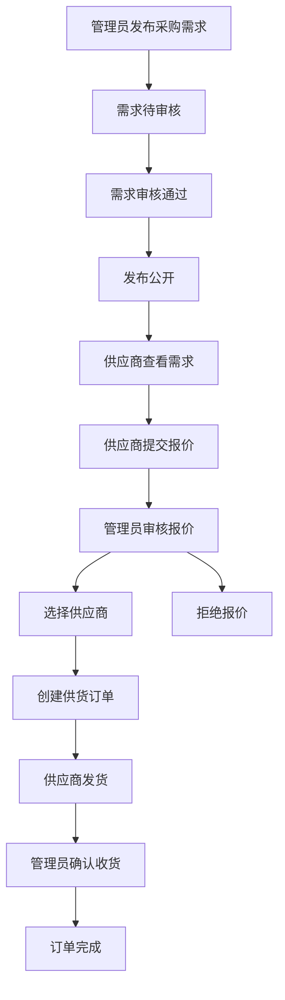
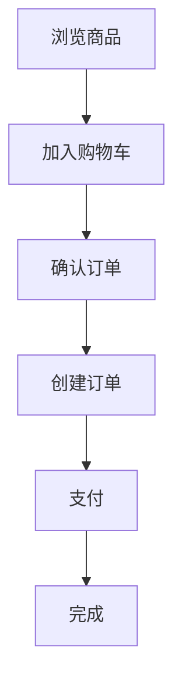

# B2B供应商供货系统

## 项目概述

这是一个**B2B电商采购供应系统**，包含多角色权限管理，支持管理员发布采购需求、供应商报价、供货订单全流程管理，同时保留传统B2C零售功能（商品展示、购物车、订单）。

## 技术栈

### 后端
- **框架**: [[Express.js]]
- **数据库**: [[MongoDB]] (Mongoose ODM)
- **认证**: JWT Token
- **运行端口**: 3100
- **依赖**: bcryptjs, cors, dotenv, jsonwebtoken, mongoose

### 前端
- **框架**: [[UniApp]]
- **开发语言**: Vue.js
- **支持平台**: 多端发布（H5、小程序、App）

## 项目结构

- **后端**: `D:\uniapp_shop_back\` → [[后端项目结构]]
- **前端**: `D:\shop\` → [[前端项目结构]]

## 核心功能

### 角色权限系统
| 角色 | 权限 |
|------|------|
| **普通用户** | 浏览商品、下单购买、购物车管理、查看我的订单 |
| **供应商** | 查看采购需求、提交供货报价、管理我的报价、处理供货订单 |
| **采购员/管理员** | 发布采购需求、审核报价、管理需求、管理用户 |

### B2B供货流程



### B2C零售流程



## 状态流转

### 采购需求 (ProductDemand)
```
draft → pending_review → approved → published → closed / cancelled
```

- **draft**: 草稿
- **pending_review**: 待审核
- **approved**: 已审核
- **published**: 已发布
- **closed**: 已关闭
- **cancelled**: 已取消

### 供货报价 (SupplyOffer)
```
submitted → approved / rejected / withdrawn
```

- **submitted**: 已提交
- **pending**: 待审核
- **approved**: 已通过
- **rejected**: 已拒绝
- **withdrawn**: 已撤回

### 供货订单 (SupplyOrder)
```
approved → shipped → confirmed → completed / cancelled
```

- **approved**: 待发货
- **shipped**: 已发货
- **in_transit**: 运输中
- **confirmed**: 已收货
- **completed**: 已完成
- **cancelled**: 已取消

## 数据模型

- [[用户模型 (User)]]
- [[商品模型 (Product)]]
- [[购物车模型 (Cart)]]
- [[订单模型 (Order)]]
- [[采购需求模型 (ProductDemand)]]
- [[供货报价模型 (SupplyOffer)]]
- [[供货订单模型 (SupplyOrder)]]

## API接口

完整接口列表 → [[API接口汇总]]

## 启动指南

### 后端启动
```bash
cd D:\uniapp_shop_back
npm install
# 配置 .env 文件中的 MongoDB 连接
npm start
# 服务运行在 http://localhost:3100
```

### 前端启动
```bash
cd D:\shop
npm install
# 使用 HBuilderX 运行或编译
```

## 环境配置

后端环境变量配置文件：`.env`
```
MONGODB_URI=mongodb://localhost:27017/uniapp_shop
PORT=3100
JWT_SECRET=your-secret-key
```

## 相关链接

- [[项目架构]]
- [[后端项目结构]]
- [[前端页面清单]]
- [[数据模型总览]]
- [[API接口汇总]]
