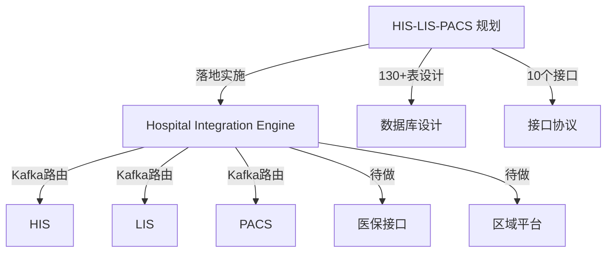

# 项目索引

所有项目的总览入口，Obsidian 关系图谱的核心节点。

## 🔥 活跃项目

- [[Hospital Integration Engine]] — HIS/LIS/PACS 集成引擎（实施中 ~40%）
- [[HIS-LIS-PACS 规划]] — 医院信息系统规划（文档完成，转入实施）

## ⏸️ 暂停项目

- [[电商项目]] — uni-app + Express/MongoDB

## 🧪 实验项目

- [[MSA Implementation]] — Memory Sparse Attention 实验

## 关系图

